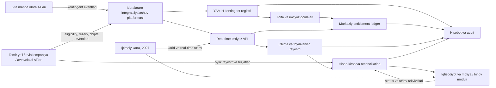
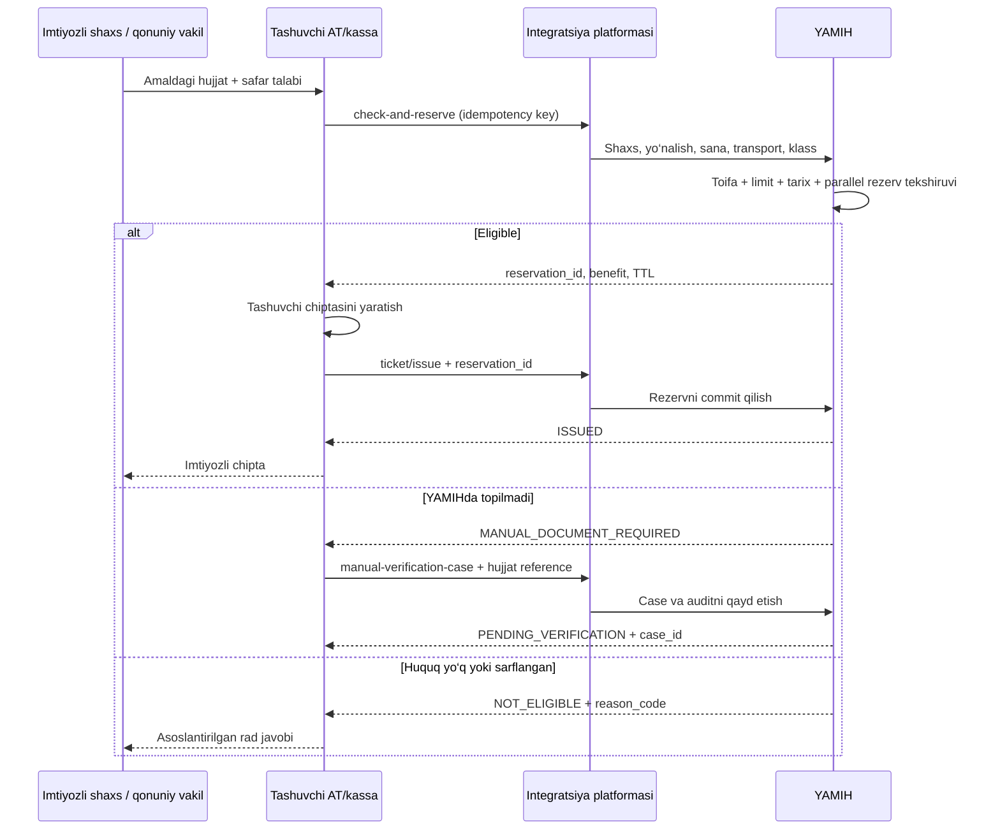

# VMQ-440 asosida transport imtiyozlari axborot tizimi

## Biznes va texnik talablar konsepsiyasi

**Versiya:** 0.1 (muhokama uchun)  
**Tayyorlangan sana:** 2026-08-18  
**Normativ manba:** [O‘zbekiston Respublikasi Vazirlar Mahkamasining 2026-yil 13-avgustdagi 440-son qarori](https://lex.uz/docs/8400823)  
**Qamrov:** 440-son qarordagi transport imtiyozlari, kontingent, chipta reyestri va xarajatlarni qoplash jarayonlari.

> Ushbu hujjat axborot tizimini loyihalash uchun konseptual talablar to‘plamidir. U rasmiy yuridik xulosa yoki tasdiqlangan texnik topshiriq o‘rnini bosmaydi. `OCHIQ MASALA` deb belgilangan qoidalar vakolatli tashkilotlar bilan yozma ravishda kelishilishi kerak.

### Belgilar va atamalar

- **Normativ talab** — 440-son qaror yoki uning ilovasida bevosita belgilangan qoida.
- **Texnik talab/tavsiya** — normani xavfsiz va izchil amalga oshirish uchun taklif; vakolatli buyurtmachi tasdiqlashi kerak.
- **Ochiq masala** — hujjatdan bir qiymatli javob chiqmaydi va yozma biznes/yuridik qaror talab qiladi.
- **Huquq (`legal entitlement`)** — shaxsning normativ asosga mansubligi; uning holati limit sarflanganidan alohida yuritiladi.
- **Imtiyoz hisobi (`benefit account/ledger`)** — muayyan yil/sikl uchun borish-qaytish limitining band qilinishi va sarflanishi.
- **Rezerv/authorization** — tashuvchi chipta chiqarayotganda limitni vaqtincha atomar band qilish.
- **Claim** — tashuvchining muayyan davr bo‘yicha xarajatlarni qoplash talabi.
- **Settlement** — claimni tekshirish, kelishish, to‘lovga yuborish va reconciliation jarayoni.
- **Xarajatlarni qoplash** — hujjatdagi ustuvor huquqiy atama; “subsidiya” faqat tashqi modulning tasdiqlangan nomi bo‘lsa ishlatiladi.

### Mundarija

1. Qisqa xulosa
2. Normativ talablar va muddatlar
3. Ishtirokchilar va javobgarlik
4. Toifalar va imtiyozlar modeli
5. Maqsadli arxitektura
6. Funksional modullar
7. End-to-end biznes jarayonlar
8. Holatlar modeli
9. Ma’lumotlar modeli
10. API konsepsiyasi
11. Xarajatni qoplash algoritmi
12. Reconciliation va ma’lumot sifati
13. Xavfsizlik va shaxsga doir ma’lumotlar
14. Nofunksional talablar
15. Hisobotlar
16. Qabul mezonlari va test ssenariylari
17. Tasdiqlanishi shart bo‘lgan savollar
18. Bosqichma-bosqich amalga oshirish
19. Talablar prioriteti
20. Yakun

## 1. Qisqa xulosa

Siz sanagan to‘rtta yo‘nalish to‘g‘ri, ammo to‘liq tizim uchun quyidagi tuzatish va qo‘shimchalar zarur.

| Dastlabki tasavvur | Xulosa | Zarur aniqlik |
|---|---|---|
| 1. 11 toifa bo‘yicha kontingent yig‘ish | Qisman to‘g‘ri | Hujjatda “11 ta toifa” degan yopiq klassifikator yo‘q. 2-ilovada 4 ta, 3-ilovada 10 ta tenglashtirish asosi va qarorning o‘zida alohida guruhlar mavjud. 11 ta biznes-profil ishlatilsa, u alohida tasdiqlanishi kerak. |
| 2. Tashuvchilarga mos/mos emasligini qaytaruvchi GET API | Mazmunan to‘g‘ri, texnik shakli o‘zgartirilishi kerak | Qaror HTTP metodini belgilamaydi. JShShIR va boshqa shaxsiy ma’lumotlarni URL/loglarda qoldirmaslik, murakkab tekshiruv va atomar rezervatsiya sabab `POST /eligibility/check-and-reserve` xavfsizroq. Oddiy `yes/no` javob yetarli emas. |
| 3. Xarid/qaytarilgan chiptalar reyestri | To‘g‘ri, lekin yetarli emas | Rasmiylashtirish va qaytarishdan tashqari rezerv, foydalanilganlik, reys bekori, boshqa sanaga ko‘chirish, qaytarish muddati, marshrut hujjati va tarif qiymatlari ham yuritilishi kerak. |
| 4. Oylik subsidiya hisoblash va modulga yuborish | Qisman to‘g‘ri | Hisob eligibility-so‘rovlari sonidan emas, tasdiqlangan `settlement_basis` bo‘yicha qoplashga yaroqli chipta qatorlari va normativ tasdiqlovchi hujjatlar reyestridan qilinadi. Qarorda bu “chipta xarajatlarini qoplash” deb ataladi. |

Markaziy tizim amalda quyidagi asosiy funksiyalarni bajarishi kerak:

1. kontingentni uzluksiz shakllantirish va tarixini saqlash;
2. huquqiy asosni imtiyoz profiliga aylantiruvchi qoidalar mexanizmi;
3. barcha tashuvchilar uchun yagona yillik/ikki yillik limit-ledger;
4. real vaqt eligibility, atomar rezervatsiya va chipta rasmiylashtirish;
5. hamrohni asosiy benefitsiarga bog‘lash;
6. chipta hayotiy sikli, foydalanilganlik va qaytarishni yuritish;
7. oylik reyestr, hisob-kitob, tekshiruv va reconciliation;
8. Iqtisodiyot va moliya vazirligining tegishli ATiga yuborish va to‘lov statusini olish;
9. 2027-yildan “Ijtimoiy karta” orqali real vaqt to‘lovini qo‘llash;
10. hisobot, audit, rad etish va shikoyat ma’lumotlarini yuritish.

## 2. Normativ talablar va muddatlar

### 2.1. Asosiy sanalar

| Talab | Muddat | Manba |
|---|---:|---|
| Qarorning kuchga kirishi | 2026-08-13 | [Lex.uz hujjat kartochkasi](https://lex.uz/docs/8400823) |
| Transport imtiyozlari tartibining boshlanishi | 2026-10-01 dan | [Qaror, 1-band](https://lex.uz/docs/8400823#8405831) |
| YAMIHda yagona baza, foydalanish holati, avtomatik javob va hisobotlar | 2026-10-01 gacha | [Qaror, 5-band](https://lex.uz/docs/8400823#8405851) |
| Manba idoralarning elektron bazalari va YAMIH integratsiyasi | 2026-10-01 gacha | [Qaror, 6-“a” band](https://lex.uz/docs/8400823#8405857) |
| Tashuvchilar kassalari/ATlarini “Ijtimoiy karta” ATga integratsiya qilish | 2026-10-01 gacha | [Qaror, 9-band](https://lex.uz/docs/8400823#8405865) |
| “Ijtimoiy karta” orqali xarid va real vaqt to‘lovi | 2027-01-01 dan | [Qaror, 8-band](https://lex.uz/docs/8400823#8405862) |
| Huquq paydo bo‘lishi/yo‘qolishi haqidagi almashinuv | uzluksiz, avtomatik | [Nizom, 8-band](https://lex.uz/docs/8400823#8405902) |
| Eligibility va foydalanilganlik tekshiruvi | murojaat vaqtida, real vaqt | [Nizom, 11 va 13-bandlar](https://lex.uz/docs/8400823#8405911) |
| Chipta berilishi yoki qaytarilishi haqida xabar | shu vaqtning o‘zida | [Nizom, 14–15-bandlar](https://lex.uz/docs/8400823#8405923) |
| Bekor qilingan qatnov chiptasini qaytarish | qatnov to‘xtatilgan sanadan bir hafta | [Nizom, 14-band](https://lex.uz/docs/8400823#8405918) |
| Tashuvchining oylik reyestri | keyingi oyning 10-sanasigacha | [Nizom, 17-band](https://lex.uz/docs/8400823#8405929) |
| Agentlikning mablag‘ o‘tkazishi | hujjatlar kelganidan keyin 10 ish kuni | [Nizom, 18-band](https://lex.uz/docs/8400823#8405930) |
| 2026-yil moliyalashtirish | Agentlikka ajratilgan mablag‘lar doirasida | [Qaror, 7-band](https://lex.uz/docs/8400823#8405861) |
| 2027-yildan moliyalashtirish | budjet so‘rovnomalari asosida Davlat budjeti parametrlarida | [Qaror, 7-band](https://lex.uz/docs/8400823#8405861) |
| Transport/Sog‘liqni saqlash vazirliklarining o‘z NHHlarini moslashtirishi | qaror qabul qilingandan boshlab 2 oy | [Qaror, 11-band](https://lex.uz/docs/8400823#8405867) |

### 2.2. Huquqning umumiy chegarasi

[Nizomning 1, 3 va 4-bandlari](https://lex.uz/docs/8400823#8405879) bo‘yicha:

- transport turlari — temir yo‘l, havo yo‘lovchi transporti va shaharlararo avtobus;
- asosiy hudud — O‘zbekiston yoki 1993-yil 12-martdagi imtiyozli yo‘l haqini o‘zaro tan olish Bitimini imzolagan davlatlar hududi;
- huquq O‘zbekiston fuqarosiga, O‘zbekistonda yashash guvohnomasiga ega chet el fuqarosiga yoki fuqaroligi bo‘lmagan shaxsga tatbiq etiladi;
- odatiy limit — benefitsiar tanloviga ko‘ra bir kalendar yilida bir marta borish va qaytish;
- bir huquqning turli tashuvchilarda takror sarflanishini to‘sish uchun markaziy limit zarur; “tanloviga ko‘ra” iborasining mixed-mode va borish/qaytish kesimidagi aniq talqini alohida tasdiqlanadi;
- alohida PF-34 toifasidagi ota-onalar O‘zbekiston hududida yiliga ikki marta temir yo‘l yoki havo transportidan bepul foydalanadi.

### 2.3. 4-ilova bo‘yicha scope chegarasi

440-son qarorning 4-ilovasida boshqa hujjatlarga ham o‘zgartirishlar kiritilgan. Ushbu loyiha uchun:

- temir yo‘l qoidalaridagi YAMIH orqali tekshirish va hujjat taqdim etish oqimi — **qamrovda**;
- ayni temir yo‘l qoidalari asosiy 11 profildan tashqari “Chernobil halokati sababli nogironligi bo‘lgan shaxslar” va boshqa avvalgi temir yo‘l imtiyozlarini ham sanaydi. Agar loyiha 152-banddagi barcha toifalarni boshqarsa, `CHERNOBYL_DISABLED_RAIL` va boshqa tegishli policylar alohida qo‘shiladi; aks holda ular tashqi/legacy scope sifatida aniq ajratiladi;
- onkologik/gematologik bemorlar va hamrohlar chiptasi, mahalliy budjetdan qoplash — boshqa huquqiy va moliyaviy jarayon, **alohida scope**;
- nogironligi bo‘lgan shaxslar bandligi va davlat ijtimoiy sug‘urtasiga oid o‘zgarishlar — transport tizimi uchun **qamrovdan tashqari**.

### 2.4. Asosiy talablar traceability jadvali

| REQ-ID | Normativ talab | Manba | Tizim qismi | Asosiy qabul dalili |
|---|---|---|---|---|
| `REQ-001` | Yagona kontingent bazasi va o‘zgarishlar | Qaror 5–6; Nizom 8 | Registry/import | Snapshot+delta reconciliation |
| `REQ-002` | Foydalangan/foydalanmagan holatni yuritish | Qaror 5 | Benefit ledger | Yillik/biennial balans testlari |
| `REQ-003` | Real vaqt huquq tekshiruvi | Nizom 11, 13 | Eligibility API | SLA va policy matrix testi |
| `REQ-004` | Parallel takror foydalanishni to‘sish | Normadan kelib chiquvchi texnik talab | Authorization ledger | Concurrent reservation testi |
| `REQ-005` | Chipta berilganda darhol xabar | Nizom 14–15 | Ticket event API | Issue idempotency/retry testi |
| `REQ-006` | Qaytarilganda darhol xabar | Nizom 15 | Return event API | Qualifying return/deadline testi |
| `REQ-007` | Qo‘shimcha hujjat taqdim etish imkoniyati | Nizom 9; 4-ilova | Manual verification | Hujjat→qaror→issue audit zanjiri |
| `REQ-008` | Elektron chipta reyestri | Nizom 15 | Ticket registry | Majburiy maydonlar validatsiyasi |
| `REQ-009` | Oylik reyestrni keyingi oyning 10-sanasigacha taqdim etish | Nizom 17 | Claim/settlement | Cutoff va ERI testi |
| `REQ-010` | Mablag‘ni 10 ish kunida o‘tkazish | Nizom 18 | Payment/SLA | Business-calendar va status testi |
| `REQ-011` | Tahliliy/statistik hisobot | Qaror 5 | Reporting | Normativ hisobotlar UAT’i |
| `REQ-012` | 2027 real vaqt to‘lovi | Qaror 8–9 | Social Card/payment | Ikki kanal anti-double-pay testi |
| `REQ-013` | Qonuniy vakil murojaatini xavfsiz bog‘lash | Nizom 5 va texnik talab | Representative verification | Haqiqiy/tugagan/vakolatsiz test |
| `REQ-014` | Oldingi yil foydalanish tarixini hisobga olish | Nizom 4 va transition qarori | Historical import | Count/checksum/sign-off testi |
| `REQ-015` | Identity/rezidentlikni authoritative tekshirish | Nizom 3, 5 | Identity adapter | Citizen/resident/stateless matrix |
| `REQ-016` | Taqsimlangan issue/commit yaxlitligi | Texnik talab | Saga/reconciliation | Lost-ACK/orphan/out-of-order test |
| `REQ-017` | Ajratilgan budjet doirasi va status nazorati | Qaror 7 | Budget/payment | Limit/commitment/rejection testi |
| `REQ-018` | 4-ilova temir yo‘l scope’ini to‘liq ajratish | Qaror 4-ilova | Policy/provider scope | Owner/API/fallback sign-off |

## 3. Ishtirokchilar va javobgarlik

| Ishtirokchi | Normativ roli | Tizimdagi roli |
|---|---|---|
| Imtiyozli shaxs yoki qonuniy vakil | Amaldagi shaxsni tasdiqlovchi hujjat bilan murojaat qiladi | Benefitsiar/safar tashabbuskori |
| Hamrohlik qiluvchi shaxs | I guruh urush nogironi yoki unga tenglashtirilgan shaxsga hamroh bo‘ladi | Asosiy benefitsiar safariga bog‘langan yo‘lovchi |
| Pensiya jamg‘armasi | O‘z vakolatidagi ma’lumotni yuritadi va uzatadi | Kontingent manbasi |
| Bojxona qo‘mitasi | O‘z vakolatidagi ma’lumotni yuritadi va uzatadi | Kontingent manbasi |
| Mudofaa vazirligi | O‘z vakolatidagi ma’lumotni yuritadi va uzatadi | Kontingent manbasi |
| Ichki ishlar vazirligi | O‘z vakolatidagi ma’lumotni yuritadi va uzatadi | Kontingent manbasi |
| Favqulodda vaziyatlar vazirligi | O‘z vakolatidagi ma’lumotni yuritadi va uzatadi | Kontingent manbasi |
| Davlat xavfsizlik xizmati | O‘z vakolatidagi ma’lumotni yuritadi va uzatadi | Kontingent manbasi |
| Ijtimoiy himoya milliy agentligi | Yagona baza, javob, hisobot va qoplashni ta’minlaydi | Tizim egasi, to‘lov tashabbuskori |
| YAMIH AT | Kontingent va foydalanilgan/foydalanilmagan holatni yuritadi | Markaziy master va entitlement-ledger |
| Idoralararo integratsiyalashuv platformasi | Majburiy elektron almashinuv kanali | API gateway/integratsiya shlyuzi |
| `Uzbekistan Airways` va boshqa rezident aviakompaniyalar | Tekshiradi, chipta beradi/qaytaradi, reyestr yuboradi | Carrier/ticket issuer/claimant |
| `O‘zbekiston temir yo‘llari` AJ vakolatli bo‘linmalari | Tekshiradi, chipta beradi/qaytaradi, reyestr yuboradi | Carrier/ticket issuer/claimant |
| Avtovokzal va avtostansiyalar | Shaharlararo avtobus chiptalarini beradi va hisobini yuritadi | Issuer/claimant; avtobus operatori bilan munosabat aniqlashtiriladi |
| Transport vazirligi | Tashuvchilar integratsiyasi va ma’lumot taqdim etishini nazorat qiladi | Ishtirokchilar katalogi va monitoring egasi |
| Iqtisodiyot va moliya vazirligi ATlari | Mablag‘ o‘tkazish kanali | Tashqi to‘lov integratsiyasi; aniq AT/API tasdiqlanadi |
| Tijorat banklari | Tashuvchining hisobvarag‘iga mablag‘ qabul qiladi | To‘lov yakuniy kanali |
| “Ijtimoiy karta” AT va mobil ilova | 2027-yildan xarid va real vaqt to‘lovi | Yangi savdo/to‘lov kanali |
| Ijtimoiy inspeksiya | Nizom talablariga rioya etilishini nazorat qiladi | Read-only auditor |
| Davlat moliyaviy nazorati inspeksiyasi | Budjet mablag‘lari asoslanganligini nazorat qiladi | Moliyaviy auditor/export oluvchi |
| Yuqori turuvchi organ yoki sud | Rad etish ustidan shikoyatni ko‘radi | Tizimdan dalil/audit oluvchi |

> Nizom 8-bandiga ko‘ra urush nogironlari va ularga tenglashtirilgan shaxslarning nogironlik ma’lumoti YAMIHda yuritiladi. Qolgan toifa/atributlar uchun qaror qaysi manba idora master ekanini ajratmagan. `toifa × atribut × manba × tasdiqlovchi hujjat × vakolat` ownership-matritsasi tizim ishlab chiqilishidan oldin tasdiqlanishi shart.

## 4. Toifalar va imtiyozlar modeli

### 4.1. “11 toifa” masalasi

Hujjatda “11 ta toifa” degan yopiq, raqamlangan klassifikator yo‘q:

- [2-ilovada](https://lex.uz/docs/8400823#8405944) urush nogironiga tenglashtirishning 4 ta asosi;
- [3-ilovada](https://lex.uz/docs/8400823#8405953) urush qatnashchisiga tenglashtirishning 10 ta asosi;
- qaror va Nizomning o‘zida urush nogironlari, urush qatnashchilari, mukofot sohiblari, Chernobil toifasi, hamroh va halok bo‘lgan harbiy/xodim ota-onalari kabi alohida guruhlar mavjud.

Shuning uchun bazada ikki qatlamli klassifikator ishlatilishi tavsiya etiladi:

1. `legal_basis_code` — huquqning aynan qaysi normativ asosga mansubligi;
2. `benefit_policy_code` — shu asosdan hisoblangan transport turi, foiz, hudud va davriylik qoidasi.

Bu yondashuv 11 ta biznes-profilni ishlatishga imkon beradi, lekin `11` sonini dastur kodiga qattiq bog‘lamaydi.

### 4.2. Muhokama uchun 11 ta texnik profil

Quyidagi jadval **normativ hujjatdagi tayyor klassifikator emas**, balki tizim uchun tavsiya etiladigan dastlabki normalizatsiyadir.

| Kod | Kontingent | Bepul | 50% chegirma | Limit |
|---|---|---|---|---|
| `C01` | 1941–1945-yillardagi urushda I yoki II guruh nogironi | Temir yo‘l | Havo, shaharlararo avtobus | Yiliga 1 borish-qaytish |
| `C02` | `C01` ga tenglashtirilgan I/II guruh shaxs | Temir yo‘l | Havo, shaharlararo avtobus | Yiliga 1 borish-qaytish |
| `C03` | 1941–1945-yillardagi urushda III guruh nogironi | Temir yo‘l | Havo, shaharlararo avtobus | Yiliga 1 borish-qaytish |
| `C04` | `C03` ga tenglashtirilgan III guruh shaxs | Temir yo‘l | Havo, shaharlararo avtobus | Yiliga 1 borish-qaytish |
| `C05` | 1941–1945-yillardagi urush qatnashchisi | Temir yo‘l | Havo, shaharlararo avtobus | Yiliga 1 borish-qaytish |
| `C06` | Sovet Ittifoqi Qahramoni yoki “Slava” ordenining uchala darajasi sohibi | Temir yo‘l, havo, shaharlararo avtobus | — | Yiliga 1 borish-qaytish |
| `C07` | Chernobil AES oqibatida nurlanish kasalligiga chalingan va uni boshidan kechirgan shaxs | Temir yo‘l, havo, shaharlararo avtobus | — | Yiliga 1 borish-qaytish |
| `C08` | I guruh urush nogironi yoki unga tenglashtirilgan shaxsning hamrohi | — | Temir yo‘l, havo, shaharlararo avtobus | Yiliga 1 borish-qaytish; asosiy benefitsiar safariga bog‘liq |
| `C09` | Urush qatnashchisiga tenglashtirilgan shaxs (`C10` asosi bundan ajratiladi) | — | Temir yo‘l, havo, shaharlararo avtobus | Yiliga 1 borish-qaytish |
| `C10` | Sobiq SSSR himoyasi/harbiy xizmat paytidagi jarohat yoki front kasalligi tufayli halok bo‘lgan harbiyning ota-onasi va turmush o‘rtog‘i | — | Temir yo‘l, havo, shaharlararo avtobus | Yiliga 1 borish-qaytish |
| `C11` | Vatan himoyasi va el-yurt tinchligi yo‘lida halok bo‘lgan harbiy xizmatchi/xodimning ota-onasi | Temir yo‘l va havo, faqat O‘zbekiston ichida | — | Yiliga 2 marta |

Asos: [Qaror, 1–2-bandlar](https://lex.uz/docs/8400823#8405831) va [Nizom, 4-band](https://lex.uz/docs/8400823#8405884).

### 4.3. Tenglashtirish asoslari

`C02/C04` ichida [2-ilovadagi](https://lex.uz/docs/8400823#8405944) `DIS_EQ_01…04`, `C09/C10` ichida [3-ilovadagi](https://lex.uz/docs/8400823#8405953) `PART_EQ_01…10` subkodlari alohida saqlanishi kerak. Bu:

- huquqiy asosni yo‘qotmaslik;
- bir shaxsning turli manbalardan takror kelishini aniqlash;
- audit va statistika;
- keyingi normativ o‘zgarishlarda profilni kodni qayta yozmasdan almashtirish uchun zarur.

#### 2-ilova — urush nogironiga tenglashtirish asoslari

| Tavsiya etiladigan subkod | Qisqacha huquqiy asos |
|---|---|
| `DIS_EQ_01` | Sobiq SSSRni qo‘riqlash, boshqa harbiy majburiyat, front yoki fuqarolik urushi partizan otryadida bo‘lish chog‘idagi yaralanish, kontuziya yoki mayiblanish natijasida nogiron bo‘lgan harbiy xizmatchi |
| `DIS_EQ_02` | Sobiq SSSR ichki ishlar yoki davlat xavfsizlik organlari tarkibida xizmat vazifasini bajarish chog‘ida yaralanish, kontuziya yoki mayiblanish oqibatida nogiron bo‘lgan shaxs |
| `DIS_EQ_03` | 1944-01-01 dan 1951-12-31 gacha Ukraina, Belarus, Litva, Latviya yoki Estoniya SSR hududidagi qiruvchi batalyon, vzvod yoki xalqni himoya qilish otryadida xizmat davrida nogiron bo‘lgan shaxs |
| `DIS_EQ_04` | Prezident hujjati bilan urush qatnashchilari uchun o‘rnatilgan imtiyozlar tatbiq etilishi belgilangan nogironligi bo‘lgan shaxs |

#### 3-ilova — urush qatnashchisiga tenglashtirish asoslari

| Tavsiya etiladigan subkod | Qisqacha huquqiy asos |
|---|---|
| `PART_EQ_01` | Sobiq SSSRni qo‘riqlash operatsiyalari yoki fuqarolik urushi harakatlarida qatnashgan amaldagi armiya qismlari/shtab/muassasalarida xizmat qilgan harbiy va sobiq partizan |
| `PART_EQ_02` | 1941–1945-yillarda amaldagi armiya qismlari, shtab va muassasalarida shtat lavozimini egallagan armiya, flot, ichki ishlar yoki davlat xavfsizligi xodimi va tegishli mudofaa shaharlarida bo‘lgan shaxs |
| `PART_EQ_03` | Sobiq SSSR mudofaasi yoki harbiy xizmatdagi jarohat/front kasalligi tufayli halok bo‘lgan harbiyning ota-onasi va beva turmush o‘rtog‘i |
| `PART_EQ_04` | 1941–1945-yillarda Leningrad korxona, muassasa yoki tashkilotida ishlagan fuqaro |
| `PART_EQ_05` | Afg‘oniston yoki boshqa davlat hududidagi jangovar harakatda qatnashib yaralangan, kontuziya olgan yoki mayib bo‘lgan harbiy, ishchi yoki xizmatchi |
| `PART_EQ_06` | Fashistlar va ittifoqchilari tashkil qilgan konslager, getto yoki boshqa majburiy saqlash joyining voyaga yetmagan sobiq mahbusi |
| `PART_EQ_07` | Antifashistik qarshilik harakati qatnashchisi |
| `PART_EQ_08` | Frontning operativ hududi manfaatlari uchun vazifa bajargan maxsus tuzilmaning sobiq xodimi |
| `PART_EQ_09` | Prezident hujjati bilan urush qatnashchisi imtiyozi tatbiq etilishi belgilangan shaxs toifasi |
| `PART_EQ_10` | Qurolli mojaro ketayotgan davlatda O‘zbekiston diplomatik vakolatxonasi, konsulligi yoki boshqa tashkiloti xavfsizligini ta’minlashda yaralangan, kontuziya olgan yoki mayib bo‘lgan harbiy xizmatchi |

`PART_EQ_03` mazmunan `C10` bilan ustma-ust, lekin matnlar aynan bir xil emas: 3-ilovada “beva turmush o‘rtog‘i”, qarorning 1-“b” bandida esa “turmush o‘rtog‘i” ishlatilgan. Ikkala normativ reference alohida saqlanadi va shaxs doirasi vakolatli yuridik talqin bilan tasdiqlanadi. Agar hisobot uchun `C10` alohida profil qilinsa, `C09`dan shu subkod chiqariladi, ammo asl `legal_basis_code = PART_EQ_03` yo‘qotilmaydi.

> **OCHIQ MASALA — 4-ilova scope’i:** `C01…C11` 1-ilova Nizomning asosiy profillarini normalizatsiya qiladi. 4-ilovadagi temir yo‘l qoidalari “Chernobil halokati sababli nogironligi bo‘lgan shaxslar”ga ham rail-only huquq beradi. Bu guruh `C07` bilan aynan bir deb hisoblanmaydi; to‘liq temir yo‘l scope’i tanlansa, `CHERNOBYL_DISABLED_RAIL` yordamchi profili va uning manbasi tasdiqlanishi kerak.

### 4.4. Qo‘shimcha biznes qoidalari

1. **Ikki yillik konversiya.** 50 foizlik imtiyozdan oldingi va joriy yilda foydalanilmagan bo‘lsa, shaxs aynan shu 50 foizlik imtiyoz belgilangan transportda har ikki kalendar yilda bir marta bepul borish-qaytish chiptasini tanlashi mumkin. Ikki yil balansining ledger debiti atomar bo‘lishi kerak; bu borish va qaytish chiptasi bir vaqtda chiqarilishi shart degani emas.
2. **Hamroh.** `C08` mustaqil kontingent emas; huquq I guruh asosiy benefitsiar safariga bog‘lanadi. “Ayni reys/sana”, hamrohning borish-qaytishda almashishi va bog‘lash mexanizmi texnik reglamentda tasdiqlanadi.
   Temir yo‘l qoidalarida bir nafardan ko‘p bo‘lmagan kuzatuvchi ko‘rsatilgan; boshqa transportlarda ham son cheklovi bir xil qo‘llanishi vakolatli talqin bilan tasdiqlanadi.
3. **Hamroh va ikki yillik konversiya.** Nizomning umumiy qoidasi bilan 4-ilovadagi temir yo‘l 152-bandining hamrohga oid xatboshilari o‘rtasida talqin noaniqligi bor. `C08` uchun ikki yillik konversiya rasmiy yuridik talqinsiz yoqilmaydi.
4. **Chipta klassi.** Aviachipta — `econom`; temir yo‘l — `econom`, platskart yoki kupe, shu jumladan tez va yuqori tezlikdagi poyezdlar. Boshqa klass uchun shaxs tasdiqlangan tarif metodikasiga muvofiq qo‘shimcha to‘lov qiladi ([Nizom, 12-band](https://lex.uz/docs/8400823#8405912)).
5. **Shaxsni tasdiqlovchi hujjat.** Hujjat chipta rasmiylashtirish va undan foydalanish paytida amal qilishi kerak. YIDXP mobil ilovasidagi raqamli hujjat qabul qilinadi ([Nizom, 5-band](https://lex.uz/docs/8400823#8405896)).
6. **Ma’lumot topilmasa.** YAMIHda huquq aniqlanmasa, shaxs tasdiqlovchi hujjat taqdim etishi mumkin; `NOT_FOUND` avtomatik yakuniy rad bo‘la olmaydi ([Nizom, 9-band](https://lex.uz/docs/8400823#8405905)).
7. **Ustuvorlik va dublikat.** Bir shaxs bir nechta huquqiy asosga tushsa, bir xil safar uchun ikki marta imtiyoz yoki qoplash berilmasligi kerak. Ustuvor profil matritsasi tasdiqlanishi lozim.

## 5. Maqsadli arxitektura



### 5.1. Tizim chegarasi

**Markaziy tizim zimmasida:**

- kontingent va huquq tarixini saqlash;
- imtiyoz profilini hisoblash;
- global limit va rezervatsiya;
- chipta eventlari va foydalanilganlik holati;
- hisob-kitob, tekshiruv va to‘lov statusi;
- audit, hisobot va integratsiya monitoringi.

**Markaziy tizim zimmasida emas:**

- transport inventari, joy tanlash va oddiy tariflarni shakllantirish;
- transport xizmatining operatsion boshqaruvi;
- bankdagi pul o‘tkazmasini bevosita bajarish;
- huquqni beruvchi asosiy hujjatni manba idora o‘rniga yaratish.

## 6. Funksional modullar

### 6.1. Kontingentni qabul qilish moduli

- boshlang‘ich to‘liq yuklama (`snapshot`) va keyingi delta-eventlarni qabul qilish;
- kanonik `RIGHT_GRANTED`, `RIGHT_CORRECTED`, `RIGHT_REVOKED`, `RIGHT_REINSTATED` eventlari; vaqtincha `SUSPENDED` holati faqat vakolat va oqibati tasdiqlansa qo‘shiladi;
- manba eventini idempotent qayta ishlash;
- bir shaxsni JShShIR, ichki `person_id` va hujjat rekvizitlari orqali moslashtirish;
- manba, huquqiy asos, amal qilish sanasi va versiya tarixini saqlash;
- snapshot uchun `as_of`, expected count/checksum, chunk completion va high-water mark; snapshotda yo‘q yozuvning avtomatik revoke qilinishi alohida tasdiqlanadi;
- ikki yillik konversiya ishga tushishi uchun oldingi yil foydalanish tarixini migratsiya qilish yoki konversiyani vaqtincha qo‘llamaslik haqidagi rasmiy transition qoidasini bajarish;
- huquq orqaga sana bilan o‘zgarsa alohida konflikt jarayoniga yuborish;
- yaroqsiz yozuvlarni `quarantine` navbatiga ajratish va manbaga xato protokolini qaytarish;
- manbalar kesimida to‘liqlik, kechikish va xato monitoringi.

### 6.2. Master-data va qoidalar moduli

- toifa, subtoifa, huquqiy asos va benefit-profil katalogi;
- transport turi, mamlakat, yo‘nalish, chipta klassi va chegirma foizi;
- qoidaning `effective_from/effective_to` bo‘yicha versiyalanishi;
- bir nechta huquq kesishganda ustuvorlik/deduplication;
- ikki yillik konversiya;
- PF-34 bo‘yicha yiliga ikki marta O‘zbekiston ichidagi safar;
- normativ o‘zgarishda eski tranzaksiyalarni eski qoida bilan qayta tiklash imkoniyati.

### 6.3. Entitlement-ledger va rezervatsiya

- bir yil/bir juft borish-qaytish huquqini markaziy yuritish;
- oldingi+joriy yil 50 foizlik huquqlarini bitta bepul huquqqa aylantirish;
- barcha tashuvchilar o‘rtasida atomar `reserve/commit/release`;
- borish va qaytish segmentlarini alohida, lekin bitta entitlement-bundle ostida yuritish;
- hamrohni asosiy safarga bog‘lash;
- rezerv uchun TTL va avtomatik bo‘shatish;
- har bir o‘zgarishni double-entryga yaqin o‘zgarmas ledger yozuvi sifatida saqlash.

### 6.4. Eligibility va chipta rasmiylashtirish moduli

- shaxs/yashash maqomi va huquq amal qilishini vakolatli identity/residency manbasi yoki tasdiqlangan hujjat tekshiruvi orqali aniqlash;
- hujjatning chipta va safar sanasida amal qilishini tekshirish;
- transport, geografiya, klass, limit va avvalgi rezervlarni tekshirish;
- `ELIGIBLE`, `MANUAL_DOCUMENT_REQUIRED`, `NOT_ELIGIBLE` natijalari;
- aniq benefit foizi, ruxsat etilgan klasslar va qolgan limitni qaytarish;
- rad sababini mashina va foydalanuvchi o‘qiydigan ko‘rinishda qaytarish;
- chipta chiqarilgach rezervni `commit` qilish;
- chipta chiqarish muvaffaqiyatsiz bo‘lsa rezervni bo‘shatish.

### 6.5. Qo‘lda tasdiqlash moduli

- YAMIHda ma’lumot topilmaganda huquqni tasdiqlovchi hujjatni qabul qilish oqimi — normativ `MUST`;
- hujjat turi, raqami, bergan organi, sanasi va operator qarorini audit qilish;
- skan nusxasi zarur bo‘lsa, alohida himoyalangan fayl omborida saqlash;
- transport turi bo‘yicha qabul qilinadigan hujjatlar katalogi; 4-ilova temir yo‘l uchun “urush oqibatida nogironligi bo‘lgan shaxs guvohnomasi”, “urush qatnashchisi guvohnomasi” yoki “imtiyozga huquqi to‘g‘risidagi guvohnoma”ni ko‘rsatadi, havo/avtobus bo‘yicha vakolat va ro‘yxat tasdiqlanishi kerak;
- vakolatli tekshiruvchi qarori, rezerv/issue bilan bog‘lanish va keyingi manba registri bilan reconciliation;
- `authorization_source` faqat server boshqaradigan maydon: yangi issue uchun `ONLINE | MANUAL_DOCUMENT`; `LEGACY_MIGRATION` faqat oldingi operatsiya/foydalanish tarixini import qilishga xizmat qiladi va yangi issue yoki claimga o‘zi mustaqil ruxsat bermaydi;
- istisno holat tashuvchining `APPROVED_EXCEPTION` qiymatini yuborishi bilan emas, vakolatli shaxs imzolagan va policy/claimga bog‘langan alohida `reconciliation/exception decision` orqali yuritiladi;
- kim, qachon va qaysi asosda qaror qilganini o‘zgarmas logda saqlash.

> Qo‘shimcha hujjatni qabul qilish huquqi mavjud, ammo vakolatsiz operator mustaqil “vaqtinchalik huquq” yarata olmaydi. Tekshiruvchi organ, hujjatlar ro‘yxati, qaror SLA’si va keyingi moliyaviy qabul mezoni ishga tushishdan oldin tasdiqlanishi kerak.

### 6.6. Chipta va qatnov reyestri

- rezerv, rasmiylashtirish, qayta rasmiylashtirish, foydalanish, qaytarish va bekor qilish eventlari;
- chipta/segment/coupon darajasidagi hisob;
- tashuvchi, filial, kassa, operator, reys, marshrut va tarif rekvizitlari;
- asosiy benefitsiar va hamroh bog‘lanishi;
- amaldagi, imtiyozli, yo‘lovchi to‘lagan va qoplashga talab qilinadigan summa;
- elektron chipta nusxasi va yo‘nalish qaydnomasi bilan bog‘lanish;
- normativ minimum sifatida chipta nusxasi va elektron yo‘lkira hujjati uchun yo‘nalish qaydnomasi; manifest/boarding kabi qo‘shimcha transport-spetsifik dalil faqat tasdiqlangan hisob-kitob reglamenti talab qilsa;
- qaytarish sababi, sana va bir haftalik deadline nazorati.

### 6.7. Oylik hisob-kitob va claim moduli

- tashuvchidan oylik reyestrni keyingi oyning 10-sanasigacha qabul qilish;
- real-time ticket-ledger bilan avtomatik solishtirish;
- qaytarilgan, takroriy, foydalanilmagan yoki noto‘g‘ri klassdagi qatorlarni ajratish;
- chipta nusxasi, yo‘nalish qaydnomasi va narxlar mavjudligini tekshirish;
- qisman qabul qilish, rad etish, tuzatishga qaytarish va qayta yuborish — tasdiqlanadigan hisob-kitob reglamentiga muvofiq;
- ERI/elektron tasdiq va rasmiy topshirilgan vaqtni qayd etish;
- 10 ish kunlik to‘lov SLA va ish kunlari kalendari;
- oldingi davr tuzatishlari va qaytarilgan mablag‘lar uchun adjustment.
- 2026-yilda Agentlikka ajratilgan mablag‘ doirasi, commitment va mavjud qoldiqni moliya ATidan olish yoki bu nazoratning tashqi egasini aniq belgilash;
- limit yetishmaganda rad, navbat yoki qisman to‘lov siyosatini audit qilinadigan sabab kodi bilan yuritish.

### 6.8. To‘lov integratsiyasi

- tasdiqlangan claimni Iqtisodiyot va moliya vazirligining tegishli ATiga yuborish; “subsidiya moduli” nomi va aniq API loyiha taxmini sifatida alohida kelishiladi;
- to‘lov topshirig‘i IDsi va budjet manbasini saqlash;
- polling va/yoki webhook orqali status olish;
- barcha modullar uchun yagona kanonik payment enum: `CREATED`, `SUBMITTED`, `ACCEPTED`, `REJECTED`, `PAYMENT_ORDER_CREATED`, `PROCESSING`, `PARTIALLY_PAID`, `PAID`, `FAILED`, `RETRYING`, `REVERSED`, `RECONCILED`;
- har bir to‘lovni aynan ERI bilan tasdiqlangan `claim_id` versiyasi va uning qabul qilingan summasiga bog‘lash;
- qisman tushgan mablag‘ni `PARTIALLY_PAID` hamda line/claim darajasidagi `payment_allocation` bilan qayd etish; tizim tashabbusi bilan qisman to‘lov topshirig‘i yaratish faqat moliyaviy reglament tasdiqlasa yoqiladi;
- `outstanding_amount = accepted_amount - paid_amount + reversed_amount`ni yuritish va qoldiq nol bo‘lmaguncha claimni yopmaslik;
- tashuvchi bank rekvizitlarini versiyalash;
- YAMIH, Iqtisodiyot va moliya vazirligining tegishli ATi hamda bank natijasi o‘rtasida reconciliation.

### 6.9. “Ijtimoiy karta” moduli

- 2027-01-01 dan ilovada bepul/chegirmali chipta xaridi;
- tashuvchiga real vaqt to‘lovi;
- bir tranzaksiyani oylik va real-time kanalda ikki marta qoplashni texnik jihatdan bloklash;
- `payment_channel = MONTHLY_CLAIM | SOCIAL_CARD_REALTIME` belgisi;
- real vaqt to‘lovi muvaffaqiyatsiz bo‘lsa retry/refund/reversal/fallback mexanizmi — texnik zarurat, aniq moliyaviy tartibi tasdiqlanadi;
- oylik reyestr va real vaqt to‘lovi o‘rtasidagi chegara, reyestrning davom etishi va transition qoidasi — ochiq biznes/yuridik masala.

### 6.10. Hisobot, audit va shikoyatlar

- qarorda talab qilingan tahliliy va statistik hisobotlar;
- barcha qaror, so‘rov, rezerv, chipta va to‘lov audit izi;
- rad etish sababi va foydalanuvchiga berilgan javob;
- yuqori turuvchi organ/sud uchun dalil paketini eksport qilish;
- Ijtimoiy inspeksiya va moliyaviy nazorat uchun read-only rol;
- xizmat ko‘rsatuvchi tashuvchilar ro‘yxatini “Inson” markazlari va ommaviy kanallarga chiqarish.

## 7. End-to-end biznes jarayonlar

### 7.1. Kontingentni shakllantirish

1. Har bir vakolatli idora o‘z ATida shaxs va huquqiy asosni yuritadi.
2. Huquq paydo bo‘lganda, o‘zgarganda, to‘xtatilganda yoki yo‘qolganda event yaratadi.
3. Event Idoralararo integratsiyalashuv platformasi orqali YAMIHga uzatiladi.
4. YAMIH `source_system + source_event_id` bo‘yicha dublikatni tekshiradi.
5. Shaxs markaziy `person_id` bilan moslashtiriladi; JShShIR biznes identifikatori bo‘lishi mumkin, lekin yagona DB primary key sifatida ishlatilmaydi.
6. Huquqiy asos, subtoifa, nogironlik guruhi, amal qilish davri va manba saqlanadi.
7. Qoidalar mexanizmi `benefit_policy_code`ni hisoblaydi.
8. Konflikt yoki to‘liq bo‘lmagan yozuv avtomatik aktivlashtirilmaydi; tekshiruv navbatiga tushadi.
9. Natija manbaga ACK/NACK va xato kodi bilan qaytariladi.
10. O‘zgarish audit va analitik qatlamga yoziladi.

### 7.2. Eligibility, rezerv va chipta chiqarish



Tekshiruv tarkibi:

- shaxsning identifikatsiyasi va rezidentlik/fuqarolik maqomi;
- huquqiy asos va uning safar sanasida amal qilishi;
- shaxsni tasdiqlovchi hujjatning rasmiylashtirish hamda safar vaqtida amal qilishi;
- transport turi, chipta klassi va yo‘nalish hududi;
- yillik yoki ikki yillik limit;
- avvalgi rezerv, chiqarilgan va ishlatilgan chiptalar;
- qonuniy vakil murojaat qilsa, vakil–benefitsiar bog‘lanishi, vakolat asosi va amal muddati;
- hamroh bo‘lsa, asosiy benefitsiar, I guruh va tasdiqlangan safar bog‘lanish qoidasi;
- boshqa klass uchun tasdiqlangan tarif metodikasidagi qo‘shimcha to‘lov qoplash bazasidan chiqarilgani.

**Muhim:** `eligibility/check` faqat ma’lumot beradi va huquqni sarflamaydi. Real chipta chiqarishda albatta atomar `reserve` yoki yagona `check-and-reserve` operatsiyasi bo‘lishi kerak. Aks holda ikki tashuvchi bir vaqtda bir xil huquqni ishlatishi mumkin.

YAMIHda huquq topilmaganida jarayon yakunlanmaydi: tashuvchi hujjatni qabul qiladi, `manual_verification_case` ochadi va tasdiqlangan vakolatli qarorni kutadi yoki transportga xos reglament bo‘yicha davom etadi. `APPROVED` qaror server tomonidan yaratilgan opaque/bir martalik `manual_authorization_token`ni qaytaradi; token benefitsiar, qaror, policy/offer, transport/yo‘nalish cheklovi, tashuvchi, amal muddati va sarflanganlik holatiga bog‘lanadi. `check-and-reserve` tokenni atomar sarflaydi va `authorization_source = MANUAL_DOCUMENT`ni serverning o‘zi belgilaydi; tashuvchi bu maydonni erkin bera olmaydi. Qarorda tekshiruvchi subyekt va SLA to‘liq ochilmagan; ular ishga tushish sharti sifatida tasdiqlanadi.

### 7.3. Borish va qaytish segmentlari

Tizim bitta `entitlement_bundle` ichida kamida ikki `leg`ni yuritadi:

- `OUTBOUND` — borish;
- `RETURN` — qaytish.

Har bir leg uchun limit holati va chipta holati alohida yuritiladi. Limit `AVAILABLE → HELD → CONSUMED/RESTORED`, chipta esa `ISSUED → TRAVELLED/RETURNED/...` holatlarini o‘tadi. Qaytarilgan leg faqat tasdiqlangan qualifying sabab va deadline bo‘lsa `RESTORED` bo‘ladi. Borish va qaytish alohida rasmiylashtirilsa, har leg uchun alohida hold/commit yaratiladi va ikkinchi leg o‘sha bundle, yil hamda tanlangan transport siyosatiga bog‘lanadi.

> **OCHIQ MASALA:** borish va qaytish turli tashuvchi yoki turli transportda bo‘lishi mumkinmi, “tanloviga ko‘ra” qaysi vaqtda lock qilinadi — hujjatda texnik darajada ochilmagan.

### 7.4. Qaytarish, foydalanmaslik va boshqa sanaga ko‘chirish

1. Tashuvchi qaytarish/bekor qilish eventini o‘z ATida qayd etadi.
2. Event shu vaqtning o‘zida YAMIHga yuboriladi.
3. Sabab `CARRIER_CANCELLED`, `TECHNICAL`, `NATURAL`, `PASSENGER_REQUEST`, `OTHER` kabi klassifikator bilan keladi.
4. Qatnov to‘xtatilgan bo‘lsa, tizim bir haftalik deadline yaratadi.
5. Texnik, tabiiy yoki boshqa qualifying sabab bilan foydalanilmagan va qatnov to‘xtagan sanadan bir hafta ichida qaytarilgan chipta taqdim etilgan deb hisoblanmaydi; dalil va sabab kodi majburiy.
6. Fuqaroning ixtiyoriy qaytarishi (`PASSENGER_REQUEST`) limitni avtomatik tiklamaydi; tasdiqlangan reglamentgacha `PENDING_DECISION`da turadi.
7. Belgilangan holatda muddatida qaytarilmasa, ticket `RETURN_DEADLINE_EXPIRED` holatiga o‘tadi, `deemed_provided = true` yuridik belgisi yoziladi va ledger `CONSUMED(reason = DEEMED_PROVIDED)` bo‘ladi. Bu `TRAVELLED` degani ham, avtomatik ravishda qoplashga yaroqli degani ham emas.
8. Boshqa sanaga ko‘chirilganda eski chipta `EXCHANGED/VOID`, yangi chipta `ISSUED` bo‘ladi va ikkalasi `reschedule_chain_id` orqali bog‘lanadi; ikki marta qoplashga yo‘l qo‘yilmaydi.
9. Qisman ishlatilgan borish-qaytish safarida hisob segment darajasida yuritiladi.
10. Allaqachon qoplangan chipta keyin qaytarilsa, adjustment/clawback tartibi tasdiqlangan moliyaviy reglament bo‘yicha qo‘llanadi.

### 7.5. Foydalanilganlikni tasdiqlash

Faqat eligibility-so‘rovlari soniga tayangan holda xarajatni qoplash mumkin emas. [Nizomning 17-bandi](https://lex.uz/docs/8400823#8405929) imtiyozdan foydalangan shaxslar reyestri, chipta nusxasi va elektron yo‘lkira hujjati uchun yo‘nalish qaydnomasini talab qiladi.

**Normativ minimum:**

- imtiyozdan foydalangan shaxslar reyestri;
- chipta nusxasi;
- elektron yo‘lkira hujjati uchun yo‘nalish qaydnomasi;
- amaldagi va imtiyozli qiymat hamda hisob-kitob.

Boarding, ticket-lift yoki yo‘lovchi manifesti qo‘shimcha nazorat sifatida foydali, lekin 440-son qarorda barcha transport uchun alohida majburiy dalil deb nomlanmagan. Qaysi transport uchun qaysi `settlement_basis` yetarli ekani alohida tasdiqlanadi, masalan `ISSUED_NOT_QUALIFYING_RETURNED` yoki `TRAVELLED_WITH_EVIDENCE`.

### 7.6. Oy yakuni va xarajatlarni qoplash

1. Tashuvchi oy yopilgach tasdiqlangan `settlement_basis`ga mos qoplashga yaroqli qatorlarni shakllantiradi; faqat `TRAVELLED`ni qabul qilish alohida metodika tasdiqlansa qo‘llanadi.
2. Keyingi oyning 10-sanasigacha reyestr, chipta nusxalari, elektron yo‘l hujjati uchun yo‘nalish qaydnomasi, amaldagi/imtiyozli narx va mablag‘ ehtiyoji hisob-kitobini yuboradi.
3. YAMIH oylik qatorlarni real-time ticket-ledger bilan solishtiradi.
4. Dublikat, qaytarilgan, foydalanilmagan, noto‘g‘ri klass, noto‘g‘ri benefit yoki hujjati yetishmaydigan qatorlar exceptionga tushadi.
5. Qatorlar bo‘yicha qisman qabul/correction siyosati tasdiqlangan hisob-kitob reglamenti bilan belgilanadi.
6. Tasdiqlangan claim Iqtisodiyot va moliya vazirligining tegishli ATiga yuboriladi.
7. To‘lov statusi, moliyaviy hujjat raqami, summa va sana YAMIHga qaytadi.
8. Hujjatlar tashuvchi tomonidan taqdim etilgan vaqtdan boshlab 10 ish kunlik muddat kuzatiladi; texnik yoki mazmuniy kamchilik bu muddatga qanday ta’sir qilishi alohida reglamentda belgilanadi.
9. `PAID` summasi tashuvchi bank ma’lumoti va moliya tizimi natijasi bilan reconciliation qilinadi.
10. Oy qayta ochilishi yoki keyingi davr adjustmenti orqali tuzatilishi — tasdiqlanadigan moliyaviy reglament qarori.

### 7.7. 2027-yil real vaqt to‘lovi

2027-01-01 dan “Ijtimoiy karta” orqali olingan chipta uchun qoplash real vaqtda tashuvchiga yuborilishi ko‘zda tutilgan. Qaror oylik reyestr tartibini bekor qilmaydi. Shu sabab quyidagilar tavsiya etiladi va transition reglamentida tasdiqlanishi kerak:

- har bir ticket/paymentda qoplash kanali belgilanadi;
- real vaqtda to‘langan qatorni oylik kanalda qayta qoplash bloklanadi;
- oylik reyestrning moliyaviy, nazorat yoki statistik roli aniq belgilanadi;
- real vaqt to‘lovi muvaffaqiyatsiz bo‘lsa avtomatik retry yoki tasdiqlangan fallback ishlaydi;
- transition sanasi va 2026-yil chiptalarining 2027-yilda safar qilishi bo‘yicha alohida qoida bo‘ladi.

### 7.8. Rad etish va shikoyat

[Nizomning 21-bandiga](https://lex.uz/docs/8400823#8405934) ko‘ra shaxs yuqori turuvchi organga yoki sudga shikoyat qilishi mumkin. Tizim har bir rad etish uchun:

- so‘rov vaqti va correlation ID;
- tashuvchi, filial, kassa/operator;
- qaror qabul qilishda ishlatilgan qoida versiyasi;
- rad kodi va tushunarli izoh;
- YAMIHdagi huquq snapshoti;
- qo‘lda berilgan hujjatlar haqida audit;
- foydalanuvchiga berilgan javob nusxasini saqlashi kerak.

## 8. Holatlar modeli

### 8.1. Huquq holati

`PENDING_VERIFICATION`, `ACTIVE`, `REVOKED`, `EXPIRED`.

`SUSPENDED` faqat vaqtincha to‘xtatish vakolati, sababi va mavjud chiptaga ta’siri rasmiy tasdiqlansa ishlatiladi. Huquq `ACTIVE` bo‘lishi benefitsiarning joriy yil limiti qolganini anglatmaydi.

### 8.2. Benefit-account/ledger holati

`AVAILABLE → HELD → CONSUMED`

Muqobil holatlar:

- `HELD → RELEASED/AVAILABLE` — TTL o‘tdi yoki chipta chiqarilmadi;
- `CONSUMED → RESTORED/AVAILABLE` — faqat qualifying qaytarish qoidasi bajarildi;
- `HELD/CONSUMED → REVIEW_REQUIRED` — retroaktiv huquq o‘zgarishi yoki konflikt;
- `CONSUMED(reason = DEEMED_PROVIDED)` — deadline’da qaytarilmagan chipta sabab limit sarflangan, lekin amalda safar alohida aniqlanadi.

### 8.3. Chipta holati

`DRAFT`, `ISSUED`, `TRAVELLED`, `CARRIER_CANCELLED`, `RETURN_PENDING`, `RETURNED`, `RETURN_DEADLINE_EXPIRED`, `NO_SHOW`, `EXCHANGED`, `VOID`, `ERROR`.

`RETURN_DEADLINE_EXPIRED` holatidagi `deemed_provided = true` yoki `NO_SHOW` `TRAVELLED` bilan teng emas va claimabilityni avtomatik belgilamaydi.

### 8.4. Claim va to‘lov holatlari

Claim va payment bitta state-machine emas. Claim — tashuvchining imzolangan talab versiyasi; payment — moliya ATi/bankdagi bir yoki bir nechta pul harakati.

Claimning asosiy oqimi:

`DRAFT → VALIDATING → READY_TO_SUBMIT → SUBMITTED → ACCEPTED → CLOSED`

Claimning muqobil holatlari:

- `VALIDATING → NEEDS_CORRECTION`;
- `NEEDS_CORRECTION → SUPERSEDED` va yangi `claim_id`/versiya bilan qayta topshirish;
- `SUBMITTED → PARTIALLY_ACCEPTED` (faqat qabul qilingan qatorlar; reglament tasdiqlansa);
- `SUBMITTED → REJECTED`;
- `ACCEPTED/PARTIALLY_ACCEPTED → ADJUSTMENT_REQUIRED` (tasdiqlangan moliyaviy metodika bo‘yicha);
- qabul qilingan summa bo‘yicha barcha payment allocationlar reconciled va `outstanding_amount = 0` bo‘lgandagina `CLOSED`.

Paymentning asosiy oqimi:

`CREATED → SUBMITTED → ACCEPTED → PAYMENT_ORDER_CREATED → PROCESSING → PAID → RECONCILED`

Paymentning muqobil holatlari:

- `SUBMITTED → REJECTED`;
- `PROCESSING → FAILED → RETRYING`;
- `PROCESSING → PARTIALLY_PAID → PAID`;
- `PARTIALLY_PAID/PAID → REVERSED` yoki yangi reversal payment yozuvi;
- qisman tushgan mablag‘ fakt sifatida doim qayd etiladi, ammo YAMIH tomonidan qisman to‘lov topshirig‘i yaratish faqat tasdiqlangan reglament asosida amalga oshiriladi.

## 9. Ma’lumotlar modeli

### 9.1. Asosiy obyektlar

| Obyekt | Maqsad | Muhim maydonlar |
|---|---|---|
| `person` | Markaziy shaxs | `person_id`, JShShIR, F.I.Sh., tug‘ilgan sana, fuqarolik/rezidentlik, holat |
| `identity_document` | Hujjat va amal muddati | tur, raqam/token, bergan organ, `valid_from`, `valid_to`, raqamli hujjat belgisi |
| `identity_verification` | Shaxs/rezidentlik tekshiruvi | authoritative source, tekshiruv vaqti, `source_as_of`, natija, hujjat tokeni |
| `legal_representative_link` | Qonuniy vakil vakolati | benefitsiar, vakil, asos hujjat, vakolat turi, `valid_from/to`, tekshirgan manba |
| `source_record` | Manba yozuvi | manba, external ID, event ID, versiya, kelgan vaqt, payload hash |
| `legal_basis` | Normativ asos | `legal_basis_code`, ilova/band, tasdiqlovchi hujjat, amal davri |
| `category_assignment` | Shaxs-toifa bog‘lanishi | subtoifa, nogironlik guruhi, source owner, status, effective dates |
| `benefit_policy` | Hisoblanadigan imtiyoz | transport, hudud, foiz, klass, limit, policy version |
| `benefit_account` | Yil/sikl limiti | shaxs, policy, cycle, available/held/consumed legs, settlement basis |
| `entitlement_bundle` | Borish-qaytish huquqi | shaxs, yil/yillar, policy, remaining legs, selected mode, status |
| `ledger_entry` | O‘zgarmas limit harakati | debit/credit, sabab, old/new balance, actor, timestamp |
| `reservation` | Vaqtinchalik band va commitdan keyin kanonik authorization yozuvi | reservation ID, TTL, carrier, journey, status, idempotency key, server-derived authorization source, policy/decision snapshot, committed time |
| `companion_link` | Hamroh bog‘lanishi | benefitsiar, hamroh, journey/bundle, amal davri |
| `manual_verification_case` | Hujjat fallbacki | transport, hujjat turi/reference, reviewer, status, decision, SLA |
| `manual_authorization` | Tasdiqlangan hujjat qarorini bir marta ishlatish | opaque token hash, case/person/policy/carrier binding, expiry, consumed time |
| `historical_usage_import` | Oldingi yil foydalanish migratsiyasi | source, `as_of`, year, count/checksum, batch/chunk, sign-off status |
| `eligibility_request` | So‘rov audit izi | request/correlation ID, actor, input hash, result, reason, rule version |
| `ticket` | Tashuvchi chiptasi | carrier ticket ID, PNR/order, issuer, passenger, status, class, currency |
| `ticket_segment` | Safar segmenti | origin, destination, departure/arrival, flight/train/bus number, leg type |
| `ticket_event` | Hayotiy sikl | event type, occurred time, source, reason, previous/new ticket |
| `travel_evidence` | Tasdiqlangan transport-spetsifik dalil | route record, manifest/boarding (agar reglament talab qilsa), file/reference, hash |
| `fare_breakdown` | Narx tarkibi | eligible fare, passenger paid, benefit, upgrade, fee, tax, rounding |
| `settlement_period` | Oy yopilishi | carrier, year/month, cutoff, status |
| `claim` | Tashuvchi talabining o‘zgarmas versiyasi | claim ID, settlement ID, version, previous claim ID, payload hash, total, accepted/rejected, outstanding, submission time, signature, status |
| `claim_line` | Chipta bo‘yicha hisob | ticket/segment, actual/preferential/compensation, validation status |
| `payment` | Moliya natijasi | payment ID, aniq claim ID/versiya, channel, order number, requested/paid/reversed amount, status, paid time |
| `payment_allocation` | To‘lovni claim yoki qatorga taqsimlash | payment ID, claim ID, claim line ID (ixtiyoriy), allocated/reversed amount, reconciliation status |
| `provider/authorized_branch` | Tashuvchi va vakolatli nuqta | yuridik shaxs, rezidentlik, transport turi, filial/kassa, status |
| `settlement_payee/bank_account_version` | Mablag‘ oluvchi | yuridik shaxs, hisobvaraq, amal davri, tasdiqlovchi manba |
| `reconciliation_case` | Tafovutni ko‘rib chiqish | tur, obyektlar, summa, mas’ul, qaror, status |
| `business_calendar` | 10 ish kunlik muddat | sana, ish/dam olish kuni, normativ manba/versiya |
| `agreement_country_version` | 1993-yilgi Bitim hududi | davlat, amal davri, manba, versiya |
| `attachment` | Tasdiqlovchi fayl | type, owner object, storage key, hash, signature, retention class |
| `appeal_case` | Rad/shikoyat tarixi | request ID, claimant, reason, status, decision, evidence package |
| `audit_log` | O‘zgarmas audit | actor, action, object, before/after hash, timestamp, correlation ID |

Huquq va policy yozuvlarida `valid_time` bilan birga `system_time/received_at` saqlanadi. Bu retroaktiv correctiondan keyin ham oldingi eligibility qarori qaysi ma’lumot snapshoti asosida chiqqanini tiklash imkonini beradi.

Normativ jihatdan urush nogironligi va unga tenglashtirilgan shaxslarning nogironlik ma’lumoti YAMIHda yuritiladi. Shaxs, fuqarolik/rezidentlik va hujjat amal muddatining authoritative manbasi esa alohida ownership-matritsada tasdiqlanishi kerak.

### 9.2. Kontingent eventining minimal tarkibi

- eventning global noyob IDsi;
- event turi va event yuz bergan vaqt;
- manba tizim va tashkilot kodi;
- manbadagi shaxs/yozuv IDsi;
- JShShIR yoki tasdiqlangan muqobil identifikator;
- huquqiy asos va subtoifa;
- nogironlik guruhi, agar qo‘llansa;
- huquqning boshlanish/tugash sanasi;
- huquq paydo bo‘lishi, tuzatilishi, qayta tiklanishi yoki yo‘qolishi sababi;
- asos hujjat rekvizitlari yoki himoyalangan reference;
- payload versiyasi, imzo/hash va idempotency key.

### 9.3. Chipta reyestrining huquqiy minimumi

[Nizomning 15-bandiga](https://lex.uz/docs/8400823#8405924) asosan kamida:

- shaxsga doir ma’lumotlar;
- imtiyoz toifasi;
- chipta rekvizitlari;
- reys/qatnov;
- yo‘nalish qaydnomasi;
- tashishning amaldagi qiymati;
- imtiyozli qiymati;
- boshqa zarur ma’lumotlar.

Tizim yaxlitligi uchun qo‘shimcha ravishda status, vaqt belgilari, segmentlar, hamroh bog‘lanishi, rezerv ID, qoida versiyasi, foydalanilganlik dalili va to‘lov kanali saqlanadi.

### 9.4. Tarixiy foydalanish importi

Ikki yillik konversiya uchun import qatori kamida quyidagilarni o‘z ichiga oladi:

- shaxsning tasdiqlangan identifikatori;
- benefit yili, huquqiy asos/policy va transport turi;
- borish/qaytish legi yoki eski talonning ekvivalent holati;
- `USED`, `UNUSED`, `RETURNED` yoki tasdiqlangan legacy status;
- eski chipta/talon reference’i va manba tashkilot;
- event/foydalanish sanasi, import `as_of` va source record version;
- dalil reference’i, payload hash va elektron imzo.

Import faqat expected count/checksum mos, dublikat va konfliktlar yopilgan, YAMIH hisoblari bilan reconciliation qilingan hamda manba+Agentlikning vakolatli sign-off’i mavjud bo‘lganda `FINALIZED` bo‘ladi. `FINALIZED` tarix yoki rasmiy transition qarori bo‘lmasa, ikki yillik konversiya faollashtirilmaydi.

## 10. API konsepsiyasi

### 10.1. Umumiy prinsiplar

- Kontingent, eligibility va chipta berish/qaytarish almashinuvi Idoralararo integratsiyalashuv platformasi orqali bajariladi. Oylik hujjatlar, moliyaviy status va “Ijtimoiy karta” APIlarining marshruti alohida integratsiya arxitekturasida tasdiqlanadi.
- JShShIR, hujjat raqami yoki boshqa shaxsiy ma’lumot URL query-stringga qo‘yilmaydi.
- Har bir yozuvchi operatsiyada `Idempotency-Key`, `X-Correlation-Id` va vaqt belgisi bo‘ladi; manba/tashuvchi identiteti sertifikat yoki token claimidan olinib bodydagi kod bilan solishtiriladi.
- mTLS va tizimlararo token/elektron imzo qo‘llanadi.
- Javob biznes qarori bilan transport xatosini ajratadi: masalan, `NOT_ELIGIBLE` — biznes javobi, HTTP `503` — vaqtinchalik texnik nosozlik.
- Eventlar tartibi `entity_version` yoki sequence orqali nazorat qilinadi.
- API versiyasi URL yoki headerda aniq ko‘rsatiladi.
- Pul maydonlari floating point emas, eng kichik pul birligidagi integer yoki decimal sifatida uzatiladi.
- Sana-vaqt ISO-8601 va `Asia/Tashkent` biznes kalendari bilan ishlaydi; UTC offset saqlanadi.
- Bir xil idempotency key+payload avvalgi javobni qaytaradi; shu key bilan boshqa payload `409 IDEMPOTENCY_PAYLOAD_MISMATCH` beradi. Kalitning scope’i va saqlash muddati kontraktda belgilanadi.
- Eligibility javobida `source_as_of`, `decision_expires_at` va stale-data belgisi qaytadi; `DATA_STALE`, `UPSTREAM_UNAVAILABLE`, `POLICY_NOT_EFFECTIVE` holatlari uchun fail-open/fail-closed reglamenti bo‘ladi.

### 10.2. Endpointlar ro‘yxati

#### Manba idoralar uchun

| Metod | Endpoint | Maqsad |
|---|---|---|
| `POST` | `/v1/beneficiary-events` | Huquq yaratish/tuzatish/qayta tiklash/bekor qilish eventini yuborish |
| `POST` | `/v1/beneficiary-snapshots/batches` | Boshlang‘ich yoki nazorat to‘liq yuklamasi |
| `POST` | `/v1/historical-usage-imports` | Oldingi yil foydalanish importini `as_of`, expected count/checksum bilan boshlash |
| `POST` | `/v1/historical-usage-imports/{import_id}/lines/batch` | Shaxs, yil, policy/mode, leg/status va manba dalili qatorlari |
| `POST` | `/v1/historical-usage-imports/{import_id}/finalize` | Checksum/reconciliation va vakolatli sign-off bilan yakunlash |
| `GET` | `/v1/operations/{operation_id}` | Asinxron batch natijasi; shaxsiy ma’lumot URLda yo‘q |
| `POST` | `/v1/data-quality/issues/{issue_id}/resolve` | Manba konflikti/tuzatish natijasini yuborish |

#### Tashuvchilar uchun

| Metod | Endpoint | Maqsad |
|---|---|---|
| `POST` | `/v1/eligibility/check` | Sarflamaydigan dastlabki tekshiruv |
| `POST` | `/v1/entitlements/check-and-reserve` | Tekshirish va global limitni atomar band qilish |
| `GET` | `/v1/reservations/{reservation_id}` | Retry/ACK yo‘qolganda authorization holatini olish |
| `POST` | `/v1/reservations/{reservation_id}/release` | Chipta chiqmasa rezervni bo‘shatish |
| `POST` | `/v1/tickets/issue` | Chipta yaratish va rezervni commit qilish |
| `GET` | `/v1/tickets/{ticket_id}` | Faqat o‘z tashuvchisining kanonik ticket holatini olish |
| `POST` | `/v1/tickets/{ticket_id}/events` | Qaytarish, foydalanish, bekor, no-show, void, reschedule |
| `POST` | `/v1/travel-evidence` | Tasdiqlangan transport-spetsifik yo‘nalish/dalil ma’lumoti |
| `POST` | `/v1/ticket-events/batches` | Uzilishdan keyingi bulk reconciliation |
| `POST` | `/v1/manual-verification-cases` | YAMIHda topilmaganda hujjat fallback case’ini yaratish |
| `POST` | `/v1/manual-verification-cases/{case_id}/documents` | Tasdiqlovchi hujjat reference/metama’lumotini qo‘shish |
| `GET` | `/v1/manual-verification-cases/{case_id}` | Vakolatli qaror holatini olish |
| `POST` | `/v1/appeals` | Rad etish bo‘yicha shikoyat/case reference’ini qayd etish |
| `GET` | `/v1/operations/{operation_id}` | Operatsiya holatini olish |

#### Agentlik yoki tasdiqlangan vakolatli ko‘rib chiquvchi uchun

| Metod | Endpoint | Maqsad |
|---|---|---|
| `POST` | `/v1/manual-verification-cases/{case_id}/decision` | Tasdiqlangan vakolat modeli va audit bilan qaror; ijobiy natijada bir martalik token |
| `POST` | `/v1/reconciliation-cases/{case_id}/decision` | Tafovut bo‘yicha qaror |
| `GET` | `/v1/audit-evidence/{decision_id}` | Qaror dalil paketini vakolat doirasida olish |

#### Hisob-kitob va to‘lov uchun

| Metod | Endpoint | Maqsad |
|---|---|---|
| `POST` | `/v1/settlements` | Oy/tashuvchi bo‘yicha draft yaratish |
| `POST` | `/v1/settlements/{settlement_id}/lines/batch` | Reyestr qatorlari va hujjat referenslarini yuborish |
| `POST` | `/v1/settlements/{settlement_id}/attachments` | Chipta nusxasi, yo‘nalish qaydnomasi va hisob hujjati referenslari |
| `POST` | `/v1/settlements/{settlement_id}/submit` | ERI bilan rasmiy topshirish |
| `GET` | `/v1/settlements/{settlement_id}` | Validatsiya va claim statusi |
| `POST` | `/v1/claims/{claim_id}/payment-submit` | Aynan ERI bilan tasdiqlangan, amaldagi claim versiyasini tegishli moliya ATiga idempotent yuborish |
| `POST` | `/v1/payment-status-events` | Tegishli moliya ATidan status webhooki |
| `GET` | `/v1/payments/{payment_id}` | To‘lov holatini polling qilish |

`settlement_id` tashuvchi+davr bo‘yicha tekshiruv konteynerini, `claim_id` esa ERI bilan rasmiy topshirilgan o‘zgarmas versiyani bildiradi. Correction/resubmit yangi `claim_id`/versiya yaratadi; oldingi versiya o‘chirilmaydi va `SUPERSEDED` bo‘ladi. Payment-submit faqat bitta `ACCEPTED` yoki reglament ruxsat etsa `PARTIALLY_ACCEPTED` claim versiyasini, uning payload hashi va tasdiqlangan summasini oladi; `settlement_id`ning o‘zi to‘lovga asos bo‘la olmaydi.

### 10.3. Nega oddiy GET tavsiya etilmaydi

Qarorda elektron real vaqt so‘rovi talab qilingan, lekin `GET` deb belgilanmagan. `GET /eligible?pinfl=...`:

- JShShIRni browser/proxy/server loglariga chiqarishi mumkin;
- transport, sana, yo‘nalish, hamroh va ikki yillik tanlov kabi murakkab inputni yomon ifodalaydi;
- faqat tekshiradi, parallel double-spendni oldini olmaydi;
- qayta urinishda huquq sarflanishi/rezerv holatini boshqara olmaydi.

Shu sabab PII bodyda yuboriladigan, autentifikatsiyalangan `POST` va idempotent rezervatsiya ishlatiladi. Agar tashqi talabda “GET” saqlanishi shart bo‘lsa, u faqat oldindan yaratilgan operatsiya natijasini `operation_id` orqali olish uchun ishlatiladi.

Bir shaxsda bir nechta profil yoki yillik/biennial variant bo‘lsa, `eligibility/check` ruxsat etilgan `offers[]` va har biri uchun `offer_id` qaytaradi. `check-and-reserve` aynan tanlangan `offer_id`ni qabul qiladi; tashuvchi bodyda benefit foizini o‘zi belgilamaydi.

### 10.4. Kontingent eventi namunasi

```json
{
  "event_id": "01JX...",
  "event_type": "RIGHT_GRANTED",
  "occurred_at": "2026-08-18T10:15:30+05:00",
  "source": {
    "organization_code": "DEFENCE_MINISTRY",
    "system_code": "DM_BENEFITS",
    "record_id": "987654",
    "record_version": 4
  },
  "person": {
    "pinfl": "**************",
    "identity_document_ref": "doc-token-from-trusted-source"
  },
  "right": {
    "legal_basis_code": "PART_EQ_10",
    "disability_group": null,
    "effective_from": "2026-10-01",
    "effective_to": null,
    "status": "ACTIVE",
    "basis_document": {
      "type_code": "AUTHORITY_DECISION",
      "number": "masked-or-tokenized",
      "issued_at": "2026-07-01"
    }
  }
}
```

### 10.5. Eligibility va rezerv so‘rovi namunasi

```json
{
  "request_id": "01JY...",
  "carrier": {
    "organization_code": "UZRAIL",
    "branch_code": "TASHKENT_CENTRAL",
    "sales_point_code": "CASH_DESK_12"
  },
  "applicant": {
    "person_identifier": {
      "type": "PINFL",
      "value": "**************"
    },
    "role": "BENEFICIARY"
  },
  "journey": {
    "transport_type": "RAIL",
    "origin_country": "UZ",
    "origin_code": "TAS",
    "destination_country": "UZ",
    "destination_code": "SKD",
    "departure_at": "2026-11-10T07:00:00+05:00",
    "return_at": null,
    "requested_legs": ["OUTBOUND"],
    "fare_class": "COUPE"
  },
  "selected_offer_id": "offer_annual_standard_rail_free",
  "manual_authorization_token": null
}
```

Ijobiy javob:

```json
{
  "request_id": "01JY...",
  "decision": "ELIGIBLE",
  "reservation_id": "res_01JY...",
  "reservation_expires_at": "2026-10-18T10:25:30+05:00",
  "benefit": {
    "offer_id": "offer_annual_standard_rail_free",
    "policy_code": "RAIL_FREE_ANNUAL",
    "discount_percent": 100,
    "allowed_fare_classes": ["ECONOMY", "PLATSKART", "COUPE"],
    "covered_legs": ["OUTBOUND"],
    "payment_channel": "MONTHLY_CLAIM"
  },
  "entitlement": {
    "bundle_id": "ent_01JY...",
    "benefit_year": 2026,
    "remaining_after_reservation": {
      "outbound": 0,
      "return": 1
    }
  },
  "source_as_of": "2026-10-18T10:15:00+05:00",
  "decision_expires_at": "2026-10-18T10:25:30+05:00",
  "rule_version": "VMQ440-2026-10-01-v1"
}
```

`applicant.role = LEGAL_REPRESENTATIVE` bo‘lsa, so‘rovda benefitsiar identifikatori, vakil identifikatori va `authority_document_ref`/tasdiqlangan vakolat tokeni beriladi. Tizim vakolatning chipta rasmiylashtirish sanasida amal qilishini tekshiradi. `carrier.organization_code` bodydan ishonch manbasi sifatida olinmaydi; u client sertifikati/token claimi bilan qat’iy solishtiriladi.

Namuna faqat `OUTBOUND` legni rezerv qiladi. `RETURN` keyin rasmiylashtirilsa, o‘sha `bundle_id`ga bog‘langan yangi leg-level authorization olinadi. Borish-qaytish birga sotilsa, ikkala leg bir authorizationda alohida hold/commit holatiga ega bo‘ladi.

Rad yoki qo‘lda hujjat talab qiluvchi javob:

```json
{
  "request_id": "01JY...",
  "decision": "MANUAL_DOCUMENT_REQUIRED",
  "reason_code": "RIGHT_NOT_FOUND_IN_YAMIH",
  "message_uz": "YAMIHda huquq aniqlanmadi. Tasdiqlovchi hujjatni tekshirish talab etiladi.",
  "appeal_reference": "case_01JY..."
}
```

Vakolatli ijobiy qaror namunasi:

```json
{
  "case_id": "case_01JY...",
  "decision": "APPROVED",
  "manual_authorization_token": "opaque-one-time-token",
  "bound_person_id": "person_01...",
  "bound_offer_id": "offer_annual_standard_rail_free",
  "bound_carrier_code": "UZRAIL",
  "expires_at": "2026-10-18T12:00:00+05:00",
  "consumption": "SINGLE_USE"
}
```

Token access-log va audit matnida ochiq saqlanmaydi; faqat hash/reference yoziladi. `check-and-reserve` muvaffaqiyatli bo‘lganda token va benefit leg bir tranzaksiyada sarflanadi.

### 10.6. Chipta rasmiylashtirish namunasi

```json
{
  "event_id": "evt_01JZ...",
  "reservation_id": "res_01JY...",
  "carrier_ticket_id": "carrier-unique-id",
  "pnr": "ABC123",
  "issued_at": "2026-10-18T10:20:00+05:00",
  "segments": [
    {
      "segment_id": "seg-1",
      "leg_type": "OUTBOUND",
      "service_number": "TRAIN-001",
      "origin_code": "TAS",
      "destination_code": "SKD",
      "departure_at": "2026-11-10T07:00:00+05:00",
      "fare_class": "COUPE",
      "actual_fare_minor": 25000000,
      "preferential_fare_minor": 0,
      "currency": "UZS",
      "currency_exponent": 2
    }
  ],
  "fare": {
    "eligible_base_minor": 25000000,
    "passenger_paid_minor": 0,
    "compensation_minor": 25000000,
    "upgrade_surcharge_minor": 0,
    "currency": "UZS",
    "currency_exponent": 2
  }
}
```

`authorization_source` issue requestida tashuvchi tomonidan yuborilmaydi. YAMIH uni `reservation_id`ga bog‘langan online qaror yoki atomar sarflangan manual token asosida serverda hosil qiladi va ticket snapshotiga yozadi.

Pul miqdorlarida `currency_exponent` kontrakt bo‘yicha majburiy: masalan, exponent `2` bo‘lsa `25000000` minor unit `250000.00 UZS`ni anglatadi. Agar davlat moliya tizimi so‘mni butun birlikda qabul qilsa, exponent va yaxlitlash qoidasi aynan shu kontraktga moslashtiriladi.

Chipta tashuvchida yaratilgach YAMIH commit javobi yo‘qolishi mumkin. Shu sabab issue operatsiyasi saga sifatida ishlaydi: bir xil idempotency key bilan retry, authorization/ticket status query, orphan-ticket reconciliation va zarur bo‘lsa kompensatsion `VOID/RELEASE` mavjud bo‘ladi. HTTP ACK yo‘qolishi yangi chipta yaratishga olib kelmasligi kerak.

### 10.7. Qaytarish eventi namunasi

```json
{
  "event_id": "evt_return_01...",
  "event_type": "RETURNED",
  "occurred_at": "2026-11-09T13:00:00+05:00",
  "reason_code": "CARRIER_CANCELLED",
  "service_cancelled_at": "2026-11-08T09:00:00+05:00",
  "segments": ["seg-1"],
  "refund": {
    "passenger_refund_minor": 0,
    "original_compensation_minor": 25000000,
    "settlement_action": "REVIEW_REQUIRED",
    "currency": "UZS",
    "currency_exponent": 2
  },
  "replacement_ticket_id": null
}
```

### 10.8. To‘lov status eventi namunasi

```json
{
  "event_id": "payevt_01...",
  "claim_id": "claim_2026_10_UZRAIL",
  "payment_id": "treasury-payment-id",
  "status": "PAID",
  "amount_minor": 1250000000,
  "currency": "UZS",
  "currency_exponent": 2,
  "payment_order_number": "PO-2026-001234",
  "paid_at": "2026-11-20T15:10:00+05:00"
}
```

### 10.9. Asosiy biznes xato kodlari

| Kod | Mazmuni |
|---|---|
| `PERSON_NOT_FOUND` | Shaxs aniqlanmadi |
| `RIGHT_NOT_FOUND_IN_YAMIH` | YAMIHda huquq topilmadi; hujjat fallbacki mumkin |
| `RIGHT_NOT_ACTIVE` | Huquq safar sanasida faol emas |
| `POLICY_NOT_EFFECTIVE` | Qoida chipta rasmiylashtirish/safar sanasida hali kuchga kirmagan |
| `DATA_STALE` | Authoritative ma’lumot ruxsat etilgan eskirish chegarasidan eski |
| `UPSTREAM_UNAVAILABLE` | Majburiy manba/platforma vaqtincha mavjud emas |
| `DOCUMENT_EXPIRED` | Hujjat rasmiylashtirish yoki safar vaqtida amal qilmaydi |
| `RESIDENCY_NOT_ELIGIBLE` | Fuqarolik/yashash maqomi talabga mos emas |
| `TRANSPORT_NOT_ALLOWED` | Mazkur profil uchun transport turi ruxsat etilmagan |
| `TERRITORY_NOT_ALLOWED` | Yo‘nalish huquq hududidan tashqarida |
| `FARE_CLASS_NOT_ALLOWED` | Klass qoplanadigan klassga kirmaydi |
| `ENTITLEMENT_EXHAUSTED` | Yillik/biennial limit sarflangan |
| `BIENNIAL_CONVERSION_NOT_AVAILABLE` | Ikki yillik bepul konversiya shartlari bajarilmagan |
| `COMPANION_NOT_LINKED` | Hamroh asosiy benefitsiarga/safarga bog‘lanmagan |
| `REPRESENTATIVE_AUTHORITY_INVALID` | Qonuniy vakilning vakolati topilmadi, tugagan yoki yetarli emas |
| `RESERVATION_CONFLICT` | Huquq boshqa tashuvchi tomonidan band qilingan |
| `RESERVATION_EXPIRED` | Rezerv TTL tugagan |
| `DUPLICATE_TICKET` | Chipta/event avval qayd qilingan |
| `RETURN_DEADLINE_EXPIRED` | Belgilangan qaytarish muddati o‘tgan |
| `SETTLEMENT_EVIDENCE_MISSING` | Tasdiqlangan `settlement_basis` uchun zarur hujjat/dalil yo‘q |
| `SETTLEMENT_PERIOD_CLOSED` | Yopilgan oyga to‘g‘ridan-to‘g‘ri o‘zgartirish mumkin emas |
| `PAYMENT_ALREADY_PROCESSED` | Tranzaksiya oldin qoplangan |

## 11. Xarajatni qoplash algoritmi

### 11.1. Huquqiy asos

Qarorda xarajatlar Davlat budjeti/Agentlik mablag‘lari hisobidan qoplanishi belgilangan. Tashuvchi [Nizomning 17-bandiga](https://lex.uz/docs/8400823#8405929) ko‘ra amaldagi va imtiyozli qiymatni ko‘rsatadi; Agentlik hujjatlar kelgach 10 ish kuni ichida mablag‘ o‘tkazadi.

Qoplash miqdorining tarif komponentlari, soliqlar, yig‘imlar va yaxlitlash usuli qarorda formula darajasida ochilmagan. Quyidagi formula tasdiqlash uchun konseptual modeldir.

### 11.2. Tavsiya etiladigan formula

Har bir tasdiqlangan `settlement_basis` bo‘yicha qoplashga kiritilgan chipta segmenti uchun:

```text
eligible_fare_basis =
    tasdiqlangan transport va klass bo‘yicha qoplanadigan tarif komponentlari

compensation =
    eligible_fare_basis - preferential_passenger_fare

passenger_payable =
    preferential_passenger_fare
    + upgrade_surcharge
    + non_covered_fees

monthly_claim_total =
    SUM(approved claimable segment compensation)
    - returns_after_prior_payment
    +/- approved_adjustments
```

Natijada:

- 100 foiz bepul imtiyozda `preferential_passenger_fare = 0`;
- 50 foiz imtiyozda odatda `preferential_passenger_fare = eligible_fare_basis × 50%`;
- boshqa klass uchun tasdiqlangan metodikadagi qo‘shimcha to‘lov `upgrade_surcharge` sifatida fuqaro zimmasida;
- qaytarilgan, `VOID`, `NO_SHOW` yoki `RETURN_DEADLINE_EXPIRED/deemed_provided` chipta bo‘yicha qoplash natijasi tasdiqlangan `settlement_basis` va qaytarish metodikasiga muvofiq aniqlanadi;
- bir nechta segment bo‘lsa, hisob har bir coupon/segment kesimida qilinadi;
- yaxlitlash faqat tasdiqlangan moliyaviy metodika bilan bajariladi.

### 11.3. Formuladan oldin kelishilishi shart bo‘lgan tarkib

- QQS va boshqa soliqlar;
- aeroport, vokzal/terminal yig‘imlari;
- bagaj, sug‘urta va servis haqi;
- kassa/agent komissiyasi;
- promo-tarif yoki bazaviy tarifdan qaysi biri olinishi;
- sotish sanasi yoki safar sanasidagi tarif;
- qayta rasmiylashtirish va qaytarish jarimasi;
- xalqaro yo‘nalishda valyuta va kurs sanasi;
- 0.5 tiyin/so‘m kabi yaxlitlash chegarasi;
- qisman ishlatilgan borish-qaytish chiptasi;
- to‘lovdan keyingi refund/clawback.

### 11.4. Qoplashga yaroqlilik mezoni

Claim qatori faqat quyidagilarning barchasi bajarilganda `CLAIMABLE` bo‘ladi:

1. chipta YAMIH yaratgan va commit qilingan o‘zgarmas `reservation_id`ga — ya’ni kanonik authorization yozuviga — bog‘langan hamda manbaga mos dalil mavjud: `ONLINE` uchun policy snapshot, `MANUAL_DOCUMENT` uchun atomar sarflangan manual token; `LEGACY_MIGRATION` yangi chipta/claimga mustaqil ruxsat emas, istisno esa faqat tasdiqlangan va imzolangan alohida decision orqali baholanadi;
2. rasmiylashtirish va safar paytida huquq/policy snapshoti mavjud;
3. transport turi, hudud va klass ruxsat etilgan;
4. chipta YAMIHga o‘z vaqtida yuborilgan yoki tasdiqlangan reconciliationdan o‘tgan;
5. Nizomdagi hujjatlar minimumi mavjud va transport uchun tasdiqlangan `settlement_basis` bajarilgan; manifest/boarding faqat metodika talab qilsa majburiy;
6. chipta tasdiqlangan `settlement_basis` bo‘yicha qoplashga yaroqli va ayni segment hech bir kanal orqali oldin qoplanmagan;
7. amaldagi/imtiyozli narx va talab summasi matematik mos;
8. tasdiqlovchi hujjatlar mavjud va hash/imzo tekshiruvdan o‘tgan;
9. ayni tranzaksiya “Ijtimoiy karta” orqali oldin to‘lanmagan;
10. tashuvchining bank rekviziti claim davrida faol va tasdiqlangan.

## 12. Reconciliation va ma’lumot sifati

### 12.1. Kunlik operatsion reconciliation

Quyidagilar o‘zaro solishtiriladi:

1. eligibility qarori;
2. authorization/reservation;
3. tashuvchi chipta eventi;
4. entitlement-ledger sarfi;
5. qaytarish yoki reschedule eventi;
6. yo‘nalish qaydnomasi va tasdiqlangan transport-spetsifik dalil, agar metodika talab qilsa.

Avtomatik exceptionlar:

- authorization yo‘q, ammo imtiyozli chipta mavjud;
- bir benefitsiarda parallel ikki faol imtiyozli chipta;
- qualifying sabab va deadline bilan qaytarilgan chipta bo‘yicha limit tiklanmagan;
- asl ticket topilmay turib return kelgan;
- eventlar tartibi buzilgan;
- ruxsat etilmagan klass/hudud;
- manba huquqni orqaga sana bilan bekor qilgan;
- tashuvchining `actual_fare` qiymati reference/tarif nazoratidan keskin farq qiladi.

### 12.2. Oylik moliyaviy reconciliation

Quyidagilar solishtiriladi:

1. YAMIH kanonik chipta reyestri;
2. tashuvchi yuborgan oylik reyestr;
3. chipta nusxasi va yo‘nalish qaydnomasi;
4. qoplashning tizim hisoblagan summasi;
5. tashuvchining talab summasi;
6. Iqtisodiyot va moliya vazirligining tegishli ATiga yuborilgan summa;
7. to‘lov statusi va bank natijasi.

Har bir tafovut `reconciliation_case`ga aylanadi. Bitta xato butun oylik reyestrni to‘xtatmasligi uchun qator darajasida qisman tasdiqlash tavsiya etiladi.

### 12.3. Manba ma’lumot sifati

Har bir manba uchun dashboardda:

- oxirgi muvaffaqiyatli event va snapshot vaqti;
- kunlik kelgan/yangilangan/bekor qilingan yozuvlar;
- NACK va quarantine soni;
- dublikat JShShIR yoki ziddiyatli toifalar;
- kechikib kelgan/out-of-order eventlar;
- YAMIH bilan umumiy sonlar tafovuti;
- sertifikat/integratsiya holati ko‘rsatiladi.

## 13. Xavfsizlik va shaxsga doir ma’lumotlar

### 13.1. Autentifikatsiya va vakolat

- Idoralararo platformada mTLS va xizmat akkaunti/token;
- har bir manba faqat tasdiqlangan toifalar bo‘yicha event yuborishi;
- har bir tashuvchi faqat real savdo maqsadida individual eligibility so‘rashi;
- bulk qidiruv va kontingentni ko‘chirib olishning taqiqlanishi;
- moliyaviy tasdiqda `maker-checker` va ERI;
- privilegiyali foydalanuvchilar uchun MFA/PAM;
- tashkilot, rol, hudud va maqsad bo‘yicha RBAC+ABAC.

### 13.2. Tavsiya etiladigan rollar

| Rol | Vakolat |
|---|---|
| `SOURCE_PUBLISHER` | Faqat o‘z tashkiloti vakolatidagi huquq eventlari |
| `CARRIER_ELIGIBILITY` | Individual eligibility/check-and-reserve |
| `CARRIER_ISSUER` | O‘z tashkiloti chipta eventlari |
| `CARRIER_FINANCE` | O‘z tashkiloti oylik reyestri va statuslari |
| `AGENCY_REGISTRY_OPERATOR` | Kontingent konflikti va case ko‘rish |
| `AGENCY_FINANCE_CHECKER` | Claim qatorlarini tekshirish |
| `AGENCY_FINANCE_APPROVER` | Tasdiqlangan claimni to‘lovga yuborish |
| `CASE_REVIEWER` | Hujjat fallbacki, e’tiroz va tafovut qarori |
| `SOCIAL_INSPECTOR` | Nizom ijrosi bo‘yicha read-only |
| `FINANCIAL_INSPECTOR` | Budjet asoslanganligi bo‘yicha read-only |
| `AUDITOR` | O‘zgarmas audit va qaror snapshotlari |
| `SYSTEM_ADMIN` | Infratuzilma, ammo biznes qarorini o‘zgartirish vakolatisiz |

### 13.3. Ma’lumotni himoya qilish

- JShShIR, hujjat, bank va sog‘liq/nogironlikka oid ma’lumotlarni at-rest shifrlash yoki tokenlash;
- TLS bilan in-transit shifrlash;
- URL, access-log, trace va metrikalarda JShShIRni saqlamaslik;
- tashuvchiga tashxis yoki ortiqcha huquqiy hujjatni emas, faqat zarur benefit natijasini qaytarish;
- loglarda shaxsni pseudonymized ID bilan ko‘rsatish;
- request timestamp/nonce yoki imzo orqali replay hujumidan himoya;
- provider va client bo‘yicha rate limit va anti-enumeration;
- secret/sertifikatlarni KMS/HSMda saqlash va rotatsiya;
- fayllarni antivirus/DLP tekshiruvi, hash va elektron imzo bilan qabul qilish;
- backup, restore va DR sinovlari;
- ma’lumotni saqlash va yo‘q qilish muddatini shaxsga doir ma’lumotlar, budjet va arxiv talablari asosida yuridik jihatdan tasdiqlash.

### 13.4. Audit minimumi

Har bir muhim operatsiyada:

- ishonchli vaqt belgisi;
- actor/service client va tashkilot;
- maqsad kodi;
- request/correlation/idempotency ID;
- pseudonymized shaxs IDsi;
- oldingi va keyingi holat hash;
- qoida versiyasi;
- eligibility sabab kodi;
- manual hujjat bo‘yicha vakolatli qaror va tasdiqlovchilar;
- ticket, claim, payment va reconciliation identifikatorlari saqlanadi.

Audit append-only/WORM tamoyilida bo‘lishi, administrator ham uni izsiz o‘chira olmasligi kerak.

## 14. Nofunksional talablar

Quyidagi raqamlar normativ hujjatdan olinmagan; yuklama va infratuzilma imkoniyatlari asosida tasdiqlanadigan boshlang‘ich maqsadlardir.

| Yo‘nalish | Tavsiya etiladigan boshlang‘ich maqsad |
|---|---|
| Eligibility/check-and-reserve javobi | `p95 ≤ 2 soniya`, `p99 ≤ 4 soniya` |
| API mavjudligi | oylik `≥99.9%`, tasdiqlangan maintenance oynalari alohida hisoblanadi |
| Ticket issue/return event qabul qilish | `p95 ≤ 2 soniya` ACK; normal holatda processing lag `≤30 soniya` |
| Yetkazish modeli | at-least-once, idempotency bilan effectively-once biznes natija |
| RPO | tasdiqlangan ledger tranzaksiyalari uchun maqsad `RPO = 0` |
| RTO | kritik yadro uchun maqsad `≤60 daqiqa` |
| Masshtablash | tashuvchilar soni va peak kassalar bo‘yicha gorizontal |
| Monitoring | SLA, xato kodi, source freshness, queue lag, payment delay |
| Vaqt | DBda UTC, biznes qoidalarida `Asia/Tashkent` |
| Versiyalash | API, schema va policy backward-compatible versiyalanadi |

Qo‘shimcha talablar:

- transactional inbox/outbox;
- retrylarda exponential backoff va dead-letter queue;
- circuit breaker va tashqi modul timeoutlari;
- database constraintlari bilan dublikat va double-spend himoyasi;
- trafik va eventlar bo‘yicha capacity/load test;
- har chorak yoki tasdiqlangan davriylikda DR/restore testi;
- platforma ishlamay qolganda offline/fallback rejimi faqat tasdiqlangan reglament bilan.

## 15. Hisobotlar

### 15.1. Normativ minimum

- faol/no-faol kontingent va toifa kesimi;
- kalendar yilida foydalangan/foydalanmagan shaxslar;
- transport turi va tashuvchi kesimi;
- berilgan, foydalanilgan, qaytarilgan va boshqa sanaga ko‘chirilgan chiptalar;
- amaldagi va imtiyozli qiymat;
- hisoblangan, tasdiqlangan va to‘langan mablag‘lar.

### 15.2. Operatsion va nazorat hisobotlari

- borish chiptasi bor, qaytish chiptasi yo‘q safarlar;
- yillik va ikki yillik konversiya kesimi;
- parallel/dublikat urinishlar;
- YAMIHda topilmagan va hujjat bilan tasdiqlangan holatlar;
- manba freshness va xato ko‘rsatkichlari;
- tashuvchi/API bo‘yicha timeout va xatolar;
- bir haftalik qaytarish deadline’lari;
- tasdiqlangan `settlement_basis` hujjati yoki dalili yetishmaydigan chiptalar;
- keyingi oyning 10-sanasidan kech topshirilgan reyestrlar;
- 10 ish kunlik to‘lov SLA buzilishi;
- qisman tasdiqlangan/rad qilingan claim qatorlari;
- muvaffaqiyatsiz, qaytarilgan va reconciliation qilinmagan to‘lovlar;
- budjet majburiyati, fakt va prognoz;
- 2027-yildagi oylik hamda real-time kanalni alohida va birlashtirilgan ko‘rinishda nazorat qilish.

## 16. Qabul mezonlari va test ssenariylari

### 16.1. Kontingent

- barcha 11 asosiy profil × transport × foiz × hudud × limit bo‘yicha table-driven test o‘tadi;
- bir event 10 marta qayta yuborilganda faqat bitta biznes natija paydo bo‘ladi;
- grant, revoke va correction eventlari tartibsiz kelganda to‘g‘ri versiya saqlanadi;
- bir JShShIR ikki manbadan turli asosda kelsa dublikat shaxs yaratilmaydi;
- ruxsatsiz manba boshqa idora toifasini yarata olmaydi;
- huquqning effective sanasi 2026-10-01 chegarasida to‘g‘ri ishlaydi.
- oldingi yil tarixi bor/yo‘q, foydalanilgan/foydalanilmagan va migration reconciliation holatlari tekshiriladi;
- tarix migratsiya qilinmasa ikki yillik konversiya tasdiqlangan transition qoidasi bo‘yicha bloklanadi.

### 16.2. Eligibility va ledger

- bepul temir yo‘l, 50 foiz avia/avtobus qoidalari to‘g‘ri chiqadi;
- O‘zbekiston fuqarosi, yashash guvohnomali xorijlik, fuqaroligi bo‘lmagan shaxs va huquqsiz norezident holatlari farqlanadi;
- `C11` uchun O‘zbekiston ichida temir yo‘l/havo va yiliga ikki marta ishlaydi;
- ruxsat etilmagan mamlakat, transport yoki klass rad etiladi;
- hujjat chipta paytida faol, safar vaqtida muddati tugasa rad etiladi;
- ikki tashuvchi bir vaqtda rezerv qilganda faqat bittasi muvaffaqiyatli;
- rezerv TTL o‘tganda limit qayta ochiladi;
- ikki yillik bepul konversiya ikkala yil huquqini atomar sarflaydi;
- bir nechta toifali shaxs uchun ustuvor qoida va no-double-benefit ishlaydi;
- qonuniy vakilning haqiqiy, muddati tugagan va vakolatsiz holatlari tekshiriladi;
- YAMIHda topilmagan holatda hujjat qabul qilinadi, vakolatli qaror, rezerv/issue va keyingi reconciliation to‘liq sinovdan o‘tadi;
- hamroh faqat I guruh benefitsiariga tasdiqlangan bog‘lash qoidasi asosida ruxsat oladi;
- faqat outbound chiqarish, returnni keyin chiqarish va har leg TTL/commit holati ishlaydi;
- 31-dekabr/1-yanvar kesishgan safar tasdiqlangan yil qoidasiga mos ishlaydi.

### 16.3. Chipta hayotiy sikli

- issue, return, reschedule va travelled eventlari idempotent;
- qualifying sabab va qatnov to‘xtaganidan yetti kun ichidagi qaytarish limitni tiklaydi;
- `PASSENGER_REQUEST` avtomatik limit tiklamaydi;
- deadline o‘tgach qaytarilmagan chipta `RETURN_DEADLINE_EXPIRED`, ledger esa `CONSUMED(reason=DEEMED_PROVIDED)` bo‘ladi, lekin chipta `TRAVELLED` bo‘lmaydi;
- eski va yangi chipta reschedule zanjirida ikki marta qoplanmaydi;
- qisman ishlatilgan round-trip segment darajasida hisoblanadi;
- tasdiqlangan transport-spetsifik `settlement_basis` va normativ hujjatlar minimumi bajarilmasa qator claimga o‘tmaydi;
- issue ACK yo‘qolsa bir xil idempotency key ayni ticket/ledger natijasini qaytaradi va dublikat yaratmaydi;
- TTLdan keyin kelgan issue avtomatik yangi huquq sarflamaydi: `RESERVATION_EXPIRED` va orphan-ticket case’i ochiladi, vakolatli qarorgacha claimga kirmaydi;
- YAMIH commitidan keyin carrier chipta yarata olmasa, kompensatsion `VOID/RESTORE` yoki operator case’i yakunida ledger va carrierda bittagina kanonik natija qoladi;
- return-before-issue eventi vaqtincha pending store’da saqlanadi; konfiguratsiyalangan, 24 soatdan oshmaydigan muddatda issue kelmasa DLQ/case’ga o‘tadi;
- uzilishdan keyingi batch real-time eventni takrorlasa deduplication sabab ticket, ledger va claim summasi o‘zgarmaydi.

### 16.4. Hisob-kitob va to‘lov

- dublikat hamda tasdiqlangan `settlement_basis` bo‘yicha qoplanmaydigan `RETURNED/NO_SHOW/RETURN_DEADLINE_EXPIRED` yoki boshqa foydalanilmagan chipta claimdan chiqariladi;
- 100 va 50 foiz formula, upgrade va rounding tasdiqlangan metodikaga mos;
- qisman qabul tasdiqlangan bo‘lsa, bitta xato qatorning batchga ta’siri shu reglamentga mos ishlaydi;
- keyingi oyning 10-sanasi muddati va hujjat taqdim etilganidan keyingi 10 ish kuni to‘g‘ri hisoblanadi;
- bir xil claim/to‘lov idempotency key bilan ikki marta to‘lanmaydi;
- to‘lovdan keyingi qaytarish tasdiqlangan adjustment/clawback metodikasiga mos ishlaydi;
- 2026-10-01 da “Ijtimoiy karta” carrier/kassa integratsiyasi sertifikatlangan bo‘ladi;
- 2027-01-01 da xarid va real-time to‘lov faollashadi, bir tranzaksiya ikki kanalda qayta qoplanmaydi.

### 16.5. Xavfsizlik va audit

- JShShIR URL va odatiy loglarda ko‘rinmaydi;
- tashuvchi boshqa tashuvchi chiptasini ko‘ra olmaydi;
- bulk enumeration va rate-limit buzilishi bloklanadi;
- manual hujjat bo‘yicha qaror tasdiqlangan vakolat modeli va to‘liq audit bilan bajariladi; maker-checker shu model talab qilsa qo‘llanadi;
- eligibility qarorini o‘sha vaqtdagi manba/policy snapshoti bilan qayta tiklash mumkin;
- audit yozuvini administrator yashirincha o‘zgartira olmaydi.

## 17. Ishga tushirishdan oldin tasdiqlanishi shart bo‘lgan savollar

### 17.1. Kontingent va huquq

1. Kanonik 11 ta biznes-kod, subtoifalar va har birining master-source tashkiloti qaysi?
2. Bir shaxs bir nechta toifaga kirsa, qaysi profil tanlanadi va imtiyozlar qo‘shiladimi?
3. `C09` hamda `C10`/3-ilova 3-bandidagi ustma-ustlik qanday deduplikatsiya qilinadi?
4. Chernobil bo‘yicha “nurlanish kasalligi” va boshqa hujjatlardagi “Chernobil sababli nogironlik” bir yoki alohida kontingentmi?
5. Huquq orqaga sana bilan bekor qilinsa, oldin rasmiylashtirilgan chipta va to‘langan claimga nima bo‘ladi?
6. 2025–2026-yil oldingi talon/chipta tarixini qaysi manbadan migratsiya qilish kerak?
7. Shaxs, rezidentlik va hujjat amal muddatining authoritative manbasi qaysi; ma’lumot eskirsa qanday qaror qilinadi?
8. Qonuniy vakil vakolati qaysi reyestr/hujjatdan va kim tomonidan tekshiriladi?
9. Vaqtincha `SUSPENDED` huquq holati umuman ruxsat etiladimi va mavjud chiptaga ta’siri qanday?

### 17.2. Safar va limit

10. “Tanloviga ko‘ra” transport turi birinchi rezervda lock qilinadimi?
11. Borish va qaytish alohida sana, tashuvchi yoki transportda rasmiylashtirilishi mumkinmi?
12. Yillik limit chipta chiqarilgan sana, safar sanasi yoki amalda foydalanilgan sana bo‘yicha yoziladimi?
13. 31-dekabr/1-yanvar chegarasidagi round-trip qaysi yilga tushadi?
14. `C11` dagi “yiliga ikki marta” ikki round-tripmi yoki jami ikki bir tomonlama chipta/safarmi?
15. Hamroh borish va qaytishda turli shaxs bo‘lishi mumkinmi va hamrohga ikki yillik konversiya tatbiq etiladimi?
16. Bitimni imzolagan davlatlarning amaldagi, versiyalanuvchi ro‘yxati kimdan olinadi?
17. Platforma ishlamay qolsa offline chipta berish mumkinmi va limit keyin qanday reconciliation qilinadi?

### 17.3. Qaytarish va foydalanish

18. “Texnik, tabiiy yoki boshqa sabab”ni kim va qanday hujjat bilan tasdiqlaydi?
19. Fuqaro ixtiyoriy qaytarganda limit qayta tiklanadimi?
20. “Bir hafta” yetti kalendar kunimi?
21. `NO_SHOW/DEEMED_PROVIDED` benefitni sarflaydi, ammo qoplashga yaroqlilik natijasi nima?
22. Har bir transport uchun `settlement_basis` nima va manifest/boarding talab qilinadimi?
23. Qisman ishlatilgan round-trip va majburiy rerouting qanday yuritiladi?
24. Qayta rasmiylashtirishdagi qo‘shimcha to‘lov/jarimani kim to‘laydi?

### 17.4. Moliyaviy jarayon

25. Aniq qoplash formulasi va tarif komponentlari qaysilar?
26. QQS, aeroport/vokzal yig‘imi, bagaj, servis haqi va komissiya qoplanadimi?
27. Xalqaro safarda valyuta kursi va kurs sanasi qanday?
28. Reyestrni kim ERI bilan imzolaydi va “taqdim etilgan” vaqt qaysi event?
29. Kamchilikli hujjat 10 ish kunlik muddatga qanday ta’sir qiladi?
30. Qisman tasdiqlash, rad etish, oy qayta ochish va correction batch tartibi qanday?
31. Iqtisodiyot va moliya vazirligining qaysi ATi, API, status va callback protokoli ishlatiladi?
32. Budjet commitment/qoldiq nazoratini YAMIHmi yoki tashqi moliya ATimi bajaradi; limit yetishmasa nima bo‘ladi?
33. 2027-yildan oylik mexanizm bekor qilinadimi yoki reconciliation/fallback bo‘lib qoladimi?
34. Avtovokzal/avtostansiya, avtobus operatori va mablag‘ oluvchi yuridik shaxs o‘rtasidagi rol qanday?

### 17.5. Texnik va xavfsizlik

35. Real vaqt va “shu vaqtning o‘zida” uchun aniq SLA/timeout/retry nima?
36. Kutilayotgan kontingent soni, kunlik event, peak eligibility va chiptalar hajmi qancha?
37. Saqlash muddati, arxiv va ma’lumotni yo‘q qilish tartibi qanday?
38. Axborot xavfsizligi klassi, RTO/RPO va DR talablari qanday?
39. Qo‘lda hujjat tasdiqlovchi organ, operator, hujjatlar katalogi va SLA kimniki?
40. Tashuvchilarni onboarding, sertifikatlash va testdan o‘tkazish jarayoni qanday?

## 18. Bosqichma-bosqich amalga oshirish

2026-10-01 muddati juda yaqin bo‘lgani sabab scope va integratsiya qarorlari darhol muzlatilishi kerak. Quyidagi workstreamlar parallel olib borilishi mumkin.

### 18.1. 0-bosqich — normativ/biznes qarorlar

- 11 profil va legal-basis katalogini tasdiqlash;
- source ownership matritsasi;
- yillik/ikki yillik limit algoritmi;
- fare va qoplash metodikasi;
- manual fallback va appeal reglamenti;
- oldingi yil tarixi migratsiyasi yoki ikki yillik konversiya transition qoidasi;
- oylik/real-time to‘lov transitioni.

Quyidagi qarorlar loyiha gate’i hisoblanadi:

| Decision ID | Qaror | Tavsiya etiladigan egalar | Eng kech gate |
|---|---|---|---|
| `D-01` | 11 profil, subtoifa va source ownership | Agentlik + 6 manba idora | API/policy contract freeze |
| `D-02` | Mixed-mode, benefit yili, cross-year, `C11` “ikki marta”, hamroh biennial | Agentlik + Transport vazirligi + yuridik ekspertiza | Policy UAT boshlanishidan oldin |
| `D-03` | `settlement_basis`, return/no-show/deemed-provided, tarif formulasi, ERI topshirish va 10 ish kuni | Agentlik + Transport vazirligi + Iqtisodiyot va moliya vakillari | 2026-10-01 go-live’dan oldin |
| `D-04` | Manual hujjatlar katalogi, tekshiruvchi vakolat va SLA | Agentlik + Transport vazirligi + tashuvchilar | Carrier sertifikatsiyasidan oldin |
| `D-05` | Tarix manbasi/import sign-off yoki formal transition | Agentlik + tegishli eski reyestr egalari | Ikki yillik policy faollashishidan oldin |
| `D-06` | 4-ilova 152-banddagi qo‘shimcha rail toifalari owner/API/fallbacki | Agentlik + Transport vazirligi + temir yo‘l | Temir yo‘l integratsiyasi go-live’idan oldin |
| `D-07` | Oylik va Social Card real-time kanal chegarasi | Agentlik + Transport + Iqtisodiyot va moliya vakillari | 2027-01-01 aktivatsiyasidan oldin |

`D-02`, `D-03`, `D-05` va `D-06` yopilmasdan tegishli policy yoki moliyaviy jarayon productionda faollashtirilmaydi.

### 18.2. 1-bosqich — 2026-10-01 uchun majburiy yadro

- kontingent snapshot/event qabul qilish;
- YAMIH master va policy engine;
- global entitlement-ledger;
- real-time check-and-reserve;
- issue/return eventlari;
- minimal elektron reyestr;
- qo‘shimcha hujjatni qabul qilish va vakolatli manual verification oqimi;
- qonuniy vakil va hamroh bog‘lanishi;
- oldingi yil foydalanish tarixini import/reconciliation qilish yoki tasdiqlangan transitionni qo‘llash;
- xizmat ko‘rsatuvchi tashuvchilar katalogi va uni e’lon qilish uchun eksport;
- “Ijtimoiy karta” bilan carrier/kassa integratsiyasini 2026-10-01 gacha sertifikatlash;
- integratsiya monitoringi va audit;
- tashuvchilar uchun sertifikatsiya muhiti.

### 18.3. 2-bosqich — oylik qoplash

Bu modul noma’lum keyingi bosqichga qoldirilmaydi: 2026-yil oktabr operatsiyalari uchun zarur ma’lumotlar 2026-10-01 dan yig‘ilishi, birinchi reyestr esa 2026-11-10 gacha qabul qilinishi kerak. Amaliy jihatdan settlement qabul qilish va tekshiruv yadro bilan birga ishga tushiriladi.

- Nizomdagi hujjatlar minimumi va tasdiqlangan transport-spetsifik `settlement_basis`;
- settlement batch va hujjatlar;
- formula, reconciliation va exception case;
- Iqtisodiyot va moliya vazirligining tegishli ATiga yuborish;
- status/SLA/reporting.

### 18.4. 3-bosqich — 2027 “Ijtimoiy karta”

Tashuvchilar kassalari va ATlarini “Ijtimoiy karta” ATga integratsiya qilishning normativ muddati 2026-10-01. Shu sabab integratsiya ishlab chiqish va sinovi 1-bosqich bilan parallel bajariladi; quyidagi bosqich 2027-01-01 dagi biznes faollashtirish va real vaqt to‘lovini anglatadi.

- mobil ilova va carrier checkout integratsiyasi;
- real-time payment orchestration;
- ikki kanal bo‘yicha anti-double-payment;
- real-time refund/reversal (texnik zarurat, moliyaviy tartibi tasdiqlanadi);
- oylik nazorat reconciliationi.

### 18.5. Tavsiya etiladigan loyiha artefaktlari

1. tasdiqlangan biznes talablar hujjati (BRD);
2. toifa va huquqiy asos klassifikatori;
3. source ownership va RACI;
4. BPMN jarayonlar;
5. OpenAPI 3.1 kontraktlari va error catalog;
6. event/schema katalogi;
7. logical/physical data model;
8. qoplash metodikasi;
9. axborot xavfsizligi modeli va threat model;
10. tashuvchilar uchun integration guide va sandbox;
11. migration/reconciliation rejasi;
12. qabul testi va pilot protokoli;
13. ekspluatatsiya, incident va DR reglamenti.

## 19. Yakuniy talablar prioriteti

### `MUST` — ishga tushirish uchun

- tasdiqlangan toifa/legal-basis katalogi;
- authoritative source/ownership matritsasi, jumladan YAMIHdagi nogironlik va identity/residency manbasi;
- uzluksiz kontingent almashinuvi;
- oldingi yil tarixi migratsiyasi yoki rasmiy transition qoidasi;
- real vaqt eligibility;
- markaziy global limit va atomar rezerv;
- chipta issue/return hamda foydalanilganlik reyestri;
- qo‘shimcha hujjatni qabul qilish va vakolatli manual verification;
- oylik reyestr va moliyaviy reconciliation;
- xizmat ko‘rsatuvchi tashuvchilar katalogi/e’lon eksporti;
- to‘lov statusi;
- audit, rad sababi va majburiy hisobotlar;
- shaxsiy ma’lumotlarni himoya qilish.

### `SHOULD` — barqaror ekspluatatsiya uchun

- line-level partial approval;
- source/tashuvchi self-service monitoring;
- anomaly/fraud monitoring;
- avtomatik SLA alertlari;
- data warehouse va boshqaruv dashboardlari.

### `2027 MUST`

- “Ijtimoiy karta” xarid kanali;
- tashuvchiga real vaqt to‘lovi;
- refund/reversal — texnik `MUST`, moliyaviy tartibi alohida tasdiqlanadi;
- oylik va real-time kanal o‘rtasida double-paymentni to‘sish.

## 20. Yakun

Tizimni faqat `kontingent POST + mos/mos emas GET + chipta POST + oy oxiri summa` shaklida qurish yetarli emas. To‘g‘ri markaziy model quyidagicha bo‘lishi kerak:

> **versiyalangan huquqiy asos va benefit-policy + umumtransport atomar entitlement-ledger + to‘liq chipta/qatnov hayotiy sikli + Nizomdagi hujjatlar va tasdiqlangan settlement-basis + oylik/real-time moliyaviy reconciliation + tekshiriladigan audit izi.**

Eng birinchi qaror — “11 toifa”ning rasmiy kodlari va har bir toifaning master-source tashkilotini tasdiqlash. Shundan keyin OpenAPI kontrakti, ma’lumot modeli va qoplash formulasi yakuniy ko‘rinishga keltirilishi mumkin.
